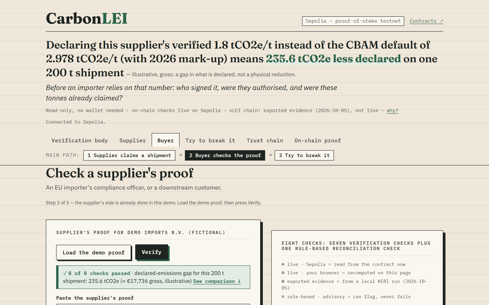
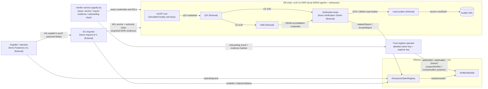

# CarbonLEI

**Checkable carbon-border (CBAM) emissions reports: who signed, were they authorised, and has each verified tonne already been claimed? GLEIF-rooted vLEI credentials plus an Ethereum Sepolia ledger.**

[](LICENSE) [](https://github.com/zuemen/carbon-lei/actions/workflows/ci.yml) [](#measurements) [](https://sepolia.etherscan.io/address/0xEA52a50d3753bACD835DCd47892754b65a90ca19#code)

[](https://zuemen.github.io/carbon-lei/)
<sub>Screenshot of the live page on Sepolia, taken 2026-10-06 (not a mock-up).</sub>

**Live demo (read-only, no wallet):** [zuemen.github.io/carbon-lei](https://zuemen.github.io/carbon-lei/)

- **Who signed:** the lead auditor's vLEI role credential (ECR), issued by the verification body, is checked against a GLEIF-rooted chain (simulated root in the demo).
- **Were they authorised:** the contract checks, at the block that registers the report, that the body is active and accredited and the auditor is not revoked.
- **Already claimed?** An on-chain ledger deducts each shipment from the report's verified tonnage (500 t in the demo) and rejects a batch claimed twice or a claim beyond what remains.

**Climate link:** without a checkable signer and tonnage, an importer cannot rely on a verified value (1.8 tCO2e/t verified vs the 2026 default of 2.978 in the demo, illustrative); CarbonLEI makes who signed it and which tonnes it covers checkable. It claims no emission reduction.

**The contract said yes; the credential said no.** In attack 4 the contract accepted an impostor's report ([tx 0x295abe6c…013](https://sepolia.etherscan.io/tx/0x295abe6cb63e3df44e942b07397ba926dcff815a6e1e2e05870f21d0dc3d0013)) after a simulated theft of the allowlist owner key; browser check 7 rejected it with `AUTHORITY_INVALID`.

All companies, people and LEIs are fictional; emissions values are illustrative; the vLEI root is simulated.

**Judge's 90-second path:** open the [demo](https://zuemen.github.io/carbon-lei/) → **Load** (the demo proof) → **Verify** → **Try to break it** → card 4.

<details><summary>More: links, the 60-second walk-through, scope and the fictional-data notice</summary>

| | |
|---|---|
| **Live demo (read-only, no wallet)** | [zuemen.github.io/carbon-lei](https://zuemen.github.io/carbon-lei/) · opens on the Buyer tab; three steps: Supplier → Buyer → Try to break it |
| Contracts on Sepolia | [On-chain proof](#on-chain-proof) |
| Documentation | [Problem statement](docs/PROBLEM_STATEMENT.md) · [Judging criteria](docs/JUDGING_CRITERIA.md) · [Architecture](docs/ARCHITECTURE.md) · [Security](docs/SECURITY.md) ([properties P1–P6](docs/SECURITY.md#9-security-properties)) · [Climate impact](docs/CLIMATE_IMPACT.md) · [Adoption](docs/ADOPTION.md) · [PACT mapping](docs/PACT_MAPPING.md) · [FAQ](docs/FAQ.md) · [vLEI setup](docs/VLEI_SETUP.md) |
| For reviewers | [Measurements](#measurements) · [Six questions reviewers ask](#six-questions-reviewers-ask) · [Footprint of CarbonLEI](docs/CLIMATE_IMPACT.md#footprint-of-carbonlei) · [Sources: 25 references (EUR-Lex, TAXUD, Eurostat, ISO, PACT and others)](#sources) |

**In 60 seconds:** open the [live demo](https://zuemen.github.io/carbon-lei/) (it opens on the Buyer tab) → press **Load the demo proof**, then **Verify**: eight checks (seven verification checks and one advisory reconciliation check), two of them read live from the Sepolia contract → open **Try to break it** and watch the counterexamples get rejected.

A ledger can show that a record has not been altered. It cannot show that the person who signed it was entitled to, or that the tonnes it covers have not been used before. CarbonLEI adds those two parts. No token is issued: CarbonLEI records claims against verified tonnage; it does not create or trade carbon credits.

CarbonLEI is a prototype for the IEEE ClimateChain Global Hackathon, track **Sustainable Supply Chains** ([hackathon facts](HACKATHON.md)). We built one corridor end to end: Taiwan fasteners into the EU. It links an EU CBAM verification report to three things that anyone the supplier chooses (an importer, a customer, a bank) can check cryptographically, without access to the CBAM Registry:

- the verifiable LEI (vLEI) of the accredited verification body;
- the role credential of the lead auditor who signed on behalf of that body;
- an on-chain ledger of how many verified tonnes have already been claimed.

What the supplier gives each buyer is **the supplier's proof**: a selective-disclosure presentation of its signed emissions credential, showing only the fields the supplier chooses to disclose. How this relates to the official CBAM Registry: [Where CarbonLEI sits](#where-carbonlei-sits-and-why-a-ledger).

All companies, people and LEIs in this repository are fictional. All emissions values are illustrative — not official CBAM methodology. Each fictional LEI returns 404 from the GLEIF API, and no GLEIF record carries the legal name of any fictional company (checked 2026-10-05).

</details>

<details><summary>Glossary</summary>

- **CBAM**: the EU Carbon Border Adjustment Mechanism; EU importers of goods such as steel screws declare the goods' embedded emissions and pay for them with CBAM certificates.
- **LEI**: Legal Entity Identifier, the ISO 17442 code for a legal entity, published by GLEIF.
- **vLEI**: verifiable LEI, a credential chained to GLEIF's root of trust (simulated in the demo) that proves an organisation's LEI (Legal Entity vLEI) or a person's role in it.
- **KERI**: Key Event Receipt Infrastructure, the key-management protocol under the vLEI; each identifier has its own signed key event log.
- **ACDC**: Authentic Chained Data Container, the KERI credential format of the vLEI, accreditation and ECR credentials.
- **ECR**: Engagement Context Role, a vLEI role credential; here the verification body issues it to its lead auditor with the role `CBAM Lead Auditor`.
- **QVI**: Qualified vLEI Issuer, an organisation qualified by GLEIF to issue Legal Entity vLEIs.
- **NAB**: national accreditation body, which accredits CBAM verifiers and can suspend or withdraw accreditation; the CBAM accreditation credential it issues in the demo is our own design.
- **SAID**: self-addressing identifier, a hash of the data it names, so any edit changes the ID; `credSAID` names the emissions credential.
- **KEL**: key event log, a KERI identifier's signed, append-only log; the lead auditor anchors `credSAID` in theirs.
- **EORI**: Economic Operators Registration and Identification number, the EU customs ID of an importer; it goes on-chain only as a salted commitment.
- **CN**: Combined Nomenclature, the EU goods classification; CN 7318 is screws, bolts and nuts.
- **EIP-712**: the Ethereum standard for signing typed data; the verification body's wallet signs the credential with it, and verifier check 3 recovers the signer.

</details>

## Who uses CarbonLEI

| User | Decision they make | Data they use | Unit of impact (baseline) |
|---|---|---|---|
| **Supplier**: export or compliance lead at a third-country producer (demo: a fictional screw maker in Kaohsiung) | Which batch and importer get how many of the 500 t of goods the report verifies | Its signed credential; remaining verified tonnage on-chain | t of goods claimed vs t verified (baseline: PDF report, no running total) |
| **EU importer**: compliance officer preparing the CBAM declaration | Accept the verified value instead of the default for this shipment; keep the on-chain record of the supplier's claim as its receipt (the demo offers a downloadable verification record, JSON, not signed) | The supplier's proof; on-chain report and shipment status; vLEI evidence; EU default values | Declared-emissions gap in tCO2e and € per tonne of goods, gross (baseline: CBAM default with mark-up) |
| **Downstream buyer or financier**: a customer or a bank, working outside the Registry | Rely on the verified value in product data, a product passport or a financing decision | The same proof and checks; the on-chain claim record | t of goods relied on vs t verified (baseline: PDF copy; signer's authority not machine-checkable, no running total) |

In the demo, EU importers and downstream customers use the same tab: Buyer.

**Beneficiary, not a user:** customs and national CBAM authorities. They gain declarations backed by evidence that software can check, but they do not operate or query CarbonLEI in this prototype.

**Data sources:** a verification report from an accredited verification body (fictional in the demo); the EU default-value tables [4]; Eurostat trade data [6].

## The problem in three questions

A CBAM verification report carries a number such as "1.8 tCO2e per tonne of screws" (illustrative). Before an EU importer relies on that number, three questions need an answer.

1. **Who is authorised to sign this number?** EU rules require each verification report to carry the "date and signature by an authorised person on behalf of the verifier, including his/her name" [1]. Inside the CBAM Registry, the verification body issues the report from an EU Login account, and its proof of representation is submitted when that account is requested [17]. A copy that leaves the Registry carries the name, but no proof of that authority that software can check. The European Fastener Distributor Association (EFDA) warns that "so-called verification certificates which are already in circulation" do not meet CBAM's verification requirements and are "not suitable for the required verification" (p. 4) [21].
2. **Is that authority still valid?** A CBAM verifier must be a legal person accredited by an EU national accreditation body (NAB). Accreditation lasts at most five years and the NAB can suspend or withdraw it [2]. Auditors also change employers.
3. **Has this tonnage already been used?** One verified report covers a period of production. The rules allow only one verification report per installation and reporting period [2]. That prevents duplicate reports, not repeated use: nothing in the report itself records how many of its verified tonnes have already been attached to shipments. We call this risk over-claiming of verified tonnage: one verified tonnage being claimed by more declarations than it covers, not the double counting discussed in emission inventories ([Climate impact](docs/CLIMATE_IMPACT.md#3-over-claiming-of-verified-tonnage-what-the-ledger-prevents)).

### Why now

- Without verified actual values, importers fall back on default values with a mark-up. For CN 7318 (screws, bolts, nuts) from Taiwan, the EU's second-largest external source of these goods (20.3% of extra-EU imports by weight in 2025 [6]), the default is 2.707 tCO2e/t. With the mark-up (+10% in 2026, +20% in 2027, +30% from 2028) it is 2.978 in 2026, about 3.25 in 2027 and 3.519 from 2028 [4].
- Verified values depend on accredited verifiers. In the Commission's state of play of 29 September 2026, 24 EU/EEA national accreditation bodies had agreed to offer CBAM accreditation, 16 were ready to accept applications, 7 had agreed to accredit verifiers from outside the EU and 5 were already accepting their applications [5]. On 7 October 2026 the Commission's list of accredited verifiers had not yet been published ("will be published on this page") [5]; first accreditations have been reported by cbamguide.com (EmiCert by Greece's ESYD, 23 September 2026; Bureau Veritas, announced 29 September 2026) [22]. The first verification reports are expected in January 2027 [5].
- The scope is still moving. The Commission has proposed extending CBAM to about 180 downstream steel and aluminium goods from 1 January 2028, COM(2025) 989. The Council adopted its position on 12 June 2026 and the Parliament adopted its position on 15 September 2026 (as reported by cbamguide.com); the file heads into trilogue negotiations between Parliament and Council; not yet agreed. The extension would apply from 1 January 2028 at the earliest [23]. CN 7318 is already in scope; the extension concerns other goods.
- No new identifier. The Commission's guidance for non-EU operators lists the LEI as an accepted company identifier for operators from countries such as Taiwan [3]. Only the verification body and its lead auditor need vLEI credentials (and an accreditation body, if it issues the accreditation credential itself); the supplier needs no vLEI: its LEI identifies it, and it needs an EVM wallet to claim shipments against its verified report.

### Climate impact in one paragraph

CarbonLEI protects the integrity of verified embedded-emissions data in CBAM supply chains: each verified tonne of goods can be claimed only once within this deployment, per credential, across importers (this does not show that the physical goods are unique; a second report for the same installation and reporting period reverts with `PeriodAlreadyCovered` unless it names the report it supersedes), and software can check who signed a value and whether the body and its auditor were authorised at the block that registered the report (revocations count from the block in which the watcher syncs them; a report registered within 24 hours before a sync is flagged CONTESTED). That is environmental transparency and carbon tracking that a PDF copy cannot give, offered outside the Registry as supplementary evidence. **What a lower verified intensity is worth.** For a fictional Taiwanese screw maker with an illustrative verified intensity of 1.8 tCO2e per tonne, the 2026 default value of 2.978 overstates declared emissions by about 1.18 tCO2e per tonne of screws. At the Q3 2026 CBAM certificate price of €82.32 [20], that gap accounts for about €97 per tonne of goods, gross, before the free-allocation adjustment, and each 0.1 tCO2e/t of verified intensity accounts for about €8.23 per tonne; the marked-up default rises to about 3.25 in 2027 and 3.519 from 2028, and from 2028 the gap accounts for about €142 per tonne at the Q3 2026 price, held constant. That value depends on the buyer trusting who signed the verified value and that its tonnes were not claimed before. Who captures it is a commercial matter between buyer and producer. A lower verified intensity could, over time, also be a reason to switch to lower-carbon steel, but that incentive is largely offset by free allocation until about 2030 and becomes complete in 2034, so we do not claim a quantified physical reduction; CarbonLEI does not measure or cut emissions itself. Illustrative — not official CBAM methodology.

The gap depends on the verified value. At 1.5 tCO2e per tonne, the 2026 gap would be about 1.48 tCO2e per tonne; at 2.5, about 0.48 tCO2e.

**Our own footprint:** one registration transaction per report plus one per shipment. No token is issued. Sepolia has no official energy data, so there is no measured per-transaction figure; a mainnet proxy, with its caveats, is in [Footprint of CarbonLEI](docs/CLIMATE_IMPACT.md#footprint-of-carbonlei). Gas per operation: [Measurements](#measurements).

Where the effect falls, inside and outside the CBAM Registry: [Climate impact — Where the effect falls](docs/CLIMATE_IMPACT.md#where-the-effect-falls). Details: [Climate impact](docs/CLIMATE_IMPACT.md).

## Where CarbonLEI sits, and why a ledger

CarbonLEI does not replace the CBAM Registry and does not submit anything to it. In the official workflow, the verification body issues the report in the Registry from its EU Login account (question 1 above). Only one verification report may cover the same installation and reporting period, with a revised report at the operator's request (Delegated Regulation (EU) 2025/2551, Annex II, point 2.17.3) [2]. The Registry is not open to the general public [18]. Neither the operator data shared through it nor the report summary given to declarants has a production-quantity field, although the summary's total direct emissions per process allow a rough estimate of output [19].

**Where CarbonLEI works: outside the Registry, and across importers.** A registered operator can share one verified value with any number of declarants, and we found no public mechanism that caps the total tonnage declared against one verified value across importers. The Commission does receive every declaration and can review it after submission under the CBAM rules (Art 19 of Regulation (EU) 2023/956 [24]); what is missing is a cap that a buyer outside the Registry can check for itself, before it relies on the value. CarbonLEI gives parties without Registry access (downstream buyers, banks, product passports, and recipients of the e-signed PDF copy in 2027) supplementary evidence: they can check by machine that the report was signed with the authority of an accredited verification body, and it adds a voluntary cap, across importers, on the tonnes of goods claimed against one verified value. For reports that stay inside the Registry, it adds a machine-checkable record and no new emissions data. The cap binds only among buyers that check the same ledger; who has a reason to take part and who would run it: [ADOPTION — Participation: when the cap binds](docs/ADOPTION.md#51-participation-when-the-cap-binds). More detail: [ADOPTION — Relationship to the CBAM Registry](docs/ADOPTION.md#11-relationship-to-the-cbam-registry).

**Why a ledger.** Short answers to the four usual questions; full answers in [ARCHITECTURE — Why a blockchain: four questions](docs/ARCHITECTURE.md#11-why-a-blockchain-four-questions).

- **Several parties write.** Verification bodies register reports, suppliers claim shipments, and importers in different member states read the same tonnage record.
- **No trusted operator? Partly.** The tonnage ledger shared across importers is the part no single party is trusted to keep. The allowlist is still written by one trust-registry operator, with limited and visible powers (Q1 in [Six questions reviewers ask](#six-questions-reviewers-ask)).
- **History matters.** An importer checks a shipment when it declares, months after the claim, and an ex-post check can come later still.
- **The data fits.** Credentials and disclosed fields stay off-chain; see the split under [Architecture](#architecture).

## How it works

1. **Onboard the verification body.** The body holds its Legal Entity vLEI and a CBAM accreditation credential issued by a NAB. An onboarding check in the verifier service (`verifier/src/onboard-check.ts`) verifies both credential chains off-chain and refuses a body without them. The trust-registry operator then calls `addVerifier` on Sepolia with the hashes of that evidence.
2. **Onboard the lead auditor.** The auditor holds an Engagement Context Role (ECR) credential issued by the verification body, role `CBAM Lead Auditor`. After the same check, the operator calls `addAuditor`, which records the hash of the ECR.
3. **Issue.** The auditor prepares a CBAM Embedded Emissions Credential. Every field is a salted digest, so fields can be disclosed one by one; the demo proof discloses 21 fields and hides 5 (process route, energy mix, supplier cost, operator ID, installation name). The credential's self-addressing identifier (`credSAID`) is the only ID used from here on. The verification body's wallet signs it with EIP-712.
4. **Anchor.** The auditor anchors `credSAID` in their own KERI key event log (KEL) and gets a sequence number, `kelSeq`.
5. **Register.** The verification body calls `registerReport`. The contract checks, at that block, that the sender is the current address of an active verification body (not suspended, accreditation not expired) and that the auditor belongs to that body and is not revoked. It records the verified tonnage. One report per installation and reporting period is enforced on-chain ([ARCHITECTURE — One report per installation and reporting period](docs/ARCHITECTURE.md#61-one-report-per-installation-and-reporting-period), [SECURITY T19](docs/SECURITY.md#4-threat-model)).
6. **Claim.** The supplier, and only the supplier address recorded with the report, claims a shipment: a salted batch key, the quantity, and a salted commitment to the importer's EORI. The contract deducts the quantity from the verified tonnage. It rejects a batch claimed twice (`BatchAlreadyClaimed`) and any claim beyond the verified tonnage (`ExceedsVerifiedTonnage`).
7. **Verify.** The EU importer receives the supplier's proof. After a structure check (check 0), the verifier runs eight checks: seven verification checks, namely SAID, disclosures, signature, on-chain validity at the shipment's claim time (including a match between the on-chain auditor and tonnage and the signed credential), shipment binding, KEL anchor and authority chain, and one advisory reconciliation check (check 8, rule-based). The same code runs in the hosted page, the SDK and the CLI (`sdk/verify.ts`).
8. **Revoke.** When the verification body revokes the auditor's ECR, or the NAB withdraws the accreditation, a watcher mirrors it on-chain with its own key, which can only suspend a body, lift a suspension or revoke an auditor (an accreditation withdrawal is mirrored as a suspension). In this prototype, the ECR revocation sync is automated: a watcher process polls the verification body's KEL for the revocation and sends the auditor revocation (`npm run vlei:watch`). Suspensions, including attack 4's, are sent manually with the watcher key. Reports registered before the sync stay valid on-chain; the verifier marks one registered within 24 hours before the sync as CONTESTED for human review (the window is a verifier setting, `contestedWindowHours`). Reports registered after the sync are rejected ([ARCHITECTURE — Time ordering](docs/ARCHITECTURE.md#8-time-ordering)).

Details: [docs/ARCHITECTURE.md](docs/ARCHITECTURE.md).

## On-chain proof

Network: Ethereum Sepolia (chain ID 11155111), a proof-of-stake testnet. Source code of both contracts verified on Etherscan.

| # | Step | Contract / function | Event or result | Etherscan link |
|---|---|---|---|---|
| — | Deploy | `VerifierAllowlist` | [`0xF7AD0cbe867eb9CE4847Af3717C2d27f6434Ea5C`](https://sepolia.etherscan.io/address/0xF7AD0cbe867eb9CE4847Af3717C2d27f6434Ea5C#code) | [deploy tx](https://sepolia.etherscan.io/tx/0x6937f992b2acd9354d1b43f7c85162b87ef86a50787f95f0f1c714ba13342a69) |
| — | Deploy | `EmissionsClaimRegistry` | [`0xEA52a50d3753bACD835DCd47892754b65a90ca19`](https://sepolia.etherscan.io/address/0xEA52a50d3753bACD835DCd47892754b65a90ca19#code) | [deploy tx](https://sepolia.etherscan.io/tx/0xc36877c6774adf47c728c8303cd0dac0a8ed2487f72908d9083aec39fce40094) |
| 1 | Verification body onboarded | `addVerifier` | `VerifierAdded` | [0x7d393bda…1b6](https://sepolia.etherscan.io/tx/0x7d393bda2d7ec11ca4f453ec9ff4b55cafb9a100aa66789eb4909237fc4ef1b6) |
| 2 | Lead auditor onboarded | `addAuditor` | `AuditorAdded` | [0x1c0be29a…16e](https://sepolia.etherscan.io/tx/0x1c0be29a41dec1cd2442168213ef3ce1f8785c9f54ec5d99aa269ba247fd416e) |
| 3 | 500 t report registered (1.8 tCO2e/t, illustrative) | `registerReport` | `ReportRegistered` | [0x5cba53bb…de2](https://sepolia.etherscan.io/tx/0x5cba53bb5a438883252721407dba8e58962ef71f1f91493c266a4ae561981de2) |
| 4 | 200 t shipment claimed | `claimShipment` | `ShipmentClaimed` | [0x2f873bd5…484](https://sepolia.etherscan.io/tx/0x2f873bd582ac399f83fcea28ffb048100d4d002f9a03e43b61e46991ae288484) |
| 5 | Importer verification | `isValidAt`, `shipmentStatus` | read only | — |
| ❌1 | Tampered input: disclosed value edited from 1.8 to 1.2 tCO2e/t | — (verifier check 2, off-chain; no contract call) | check 2 fails with `DISCLOSURE_TAMPERED` | No transaction; reproduce it on the [Try to break it tab](https://zuemen.github.io/carbon-lei/#try-to-break-it) |
| ❌2 | Same batch claimed again; the supplier claims 400 t for a second importer when 300 t remain | `claimShipment` | revert `BatchAlreadyClaimed` / `ExceedsVerifiedTonnage` | No transaction: a dry run (`eth_call`) against the live contract, on the [Try to break it tab](https://zuemen.github.io/carbon-lei/#try-to-break-it) |
| ❌3 | Auditor's ECR revoked, watcher syncs | `revokeAuditor` | `AuditorRevoked` | [0x4bcd6469…674](https://sepolia.etherscan.io/tx/0x4bcd646960c9c129b957e60f267606862a1c36ca6dc976d753e9803ddff0c674) |
| ❌3 | New report after revocation | `registerReport` | revert `AuditorNotAuthorized` (status 0) | [0xa8b6b8a8…fc5](https://sepolia.etherscan.io/tx/0xa8b6b8a8ba067de0ffda301688d64ff6c8c7662563930881c7fecc82e1e65fc5) |
| ❌4 | Simulated compromise of the allowlist owner key: an impostor body, whose vLEI chain leads to a root it controls, is added | `addVerifier` (allowlist owner key) | `VerifierAdded` | [0x5e966227…d5b](https://sepolia.etherscan.io/tx/0x5e966227967fc35ce882364fc9c5b53ef14af8b9f9253dcb9d63b42400ad3d5b) |
| ❌4 | The impostor's auditor is added | `addAuditor` (allowlist owner key) | `AuditorAdded` | [0x6282a006…376](https://sepolia.etherscan.io/tx/0x6282a006f73ce95bde47f0e92aab8841975456e918edaace0e737993dcaa4376) |
| ❌4 | The impostor registers its own report | `registerReport` | accepted (status 1): the contract checks the allowlist, not vLEI facts. Verifier check 7 fails with `AUTHORITY_INVALID`: QVI credential not issued by the configured root of trust | [0x295abe6c…013](https://sepolia.etherscan.io/tx/0x295abe6cb63e3df44e942b07397ba926dcff815a6e1e2e05870f21d0dc3d0013) |
| ❌4 | Watcher suspends the impostor body (a manual step in this demo) | `suspendVerifier` | `VerifierSuspended` | [0x61431e78…d99](https://sepolia.etherscan.io/tx/0x61431e780afea4c1cad3c12af6406955f42a0e6b93c32d9198e2701e9f96dd99) |
| ❌4 | New report from the impostor after the suspension | `registerReport` | revert `NotActiveVerifier` | No transaction: a dry run (`eth_call`) against the live contract, on the [Try to break it tab](https://zuemen.github.io/carbon-lei/#try-to-break-it) |

Blocks 11846766 (deployment) to 11846782 (claim), and 11849375 to 11849379 for attack 4, starting with test ETH sent to the impostor's wallet ([0x5ef89226…5bb](https://sepolia.etherscan.io/tx/0x5ef8922601e7b9e2b7010de8e6e4fa62826987209b1f232f7f43227ae5afa5bb)), 2026-10-05; 11854363 to 11854366 for attack 3 (the revocation sync and the rejected report), 2026-10-06. Deployment record with transaction hashes, blocks, gas and the commit it was built from: [`contracts/deployments/11155111.json`](contracts/deployments/11155111.json); the demo transactions are listed in [`fixtures/sepolia-tx.json`](fixtures/sepolia-tx.json). An earlier deployment of the same code, made before the demo credential carried its reconciliation proof, is kept in [`contracts/deployments/archive/`](contracts/deployments/archive).

| Demo wallet | Role | Address |
|---|---|---|
| Owner | Deploys the contracts; adds verification bodies and auditors | `0xD192343C04d56b5E2d8474b5845A66D07B039324` |
| Watcher | Suspends a body, lifts a suspension, revokes an auditor | `0x4d86ca97F6E7F9fECe8A77caCc963dA50a2DE042` |
| Verification body | Registers reports | `0xde347Dc94fb6a67e0d96E104E9aC1b44Bfde2D45` |
| Supplier | Claims shipments | `0xaA21B52F3b78F1f0fdACd34d50AfB68D6590f725` |
| Impostor | Attack 4: put on the allowlist by the simulated compromise of the allowlist owner key, registered one report, suspended at block 11849379; caller of the dry run after the suspension | `0xa5f6ad42cDDB539fDdA8cdd765604C1AE32D0D93` |

**Demo timeline.** The demo report covers calendar year 2026, because goods imported in 2026 use the 2026 reporting period (Implementing Regulation (EU) 2025/2547, Article 7(1)). The verification report is dated 15 March 2027 and the credential 20 March 2027 (valid until 31 December 2027), before the declaration deadline of 30 September 2027. The Sepolia transactions were sent in October 2026 to build the demo; the Verification body tab says the same.

## Demo parties (all fictional)

| Role | Name | LEI |
|---|---|---|
| Supplier (screw maker, third-country operator; needs no vLEI, its LEI identifies it; the demo's LE vLEI is optional) | Demo Fasteners Co. (fictional), Kaohsiung, UN/LOCODE `TWKHH` | `ZZZZ00TWSCREWDEMO185` |
| Verification body | Demo Verification GmbH (fictional) | `ZZZZ00EUVERIFDEMO152` |
| National accreditation body | Demo Accreditation Body (fictional) | `ZZZZ00NABACCRDEMO119` |
| EU importer (CBAM declarant) | Demo Imports B.V. (fictional) | `ZZZZ00EUIMPRTDEMO148` |
| Second EU importer (counterexample ❌2) | Demo Schrauben Import GmbH (fictional) | `ZZZZ00EUIMPRTDEMO245` |
| QVI | Demo QVI (fictional) | `ZZZZ00QVIISSRDEMO116` |
| Impostor verifier (in the demo chain it holds no vLEI and the onboarding check refuses it; in attack 4 it holds a vLEI chain it built under its own root, Self-Made Root (fictional)) | Demo Impostor Verifier (fictional) | `ZZZZ00FAKEVERFICT143` |
| Lead auditor | Lena Demo (fictional person) | — (KERI AID and ECR only) |
| Simulated GLEIF root (test keys) | Demo Root Authority (fictional) | — |

No LEI issuer uses the prefix `ZZZZ`, and no LEI record starts with it. Each LEI above has a valid ISO 17442 check digit and returns 404 from the GLEIF API (checked 2026-10-05).

## Architecture

Read left to right: credentials are issued off-chain on KERI, the trust-registry operator and the verification body write to Sepolia, and the importer checks both.



On-chain: hashes, addresses, status flags, timestamps and tonnage only. Off-chain: credentials, disclosed fields, KERI key state.

## Quick start

### Hosted (for reviewers, no installation)

Open [zuemen.github.io/carbon-lei](https://zuemen.github.io/carbon-lei/). The hosted page is read-only. It does not send transactions and needs no wallet. It opens on the Buyer tab. Tabs, in order: Verification body, Supplier, Buyer, Try to break it, Trust chain, On-chain proof. Checks 1–7 each carry one of three labels: "live · Sepolia" (read from the contract now), "live · your browser" (recomputed on the page) or "exported evidence" (from a local KERI run on 2026-10-05); check 8 is labelled advisory.

- **Buyer**: press "Load the demo proof", then "Verify". Checks 1–3 are labelled "live · your browser": check 3 recovers the EIP-712 signer under the signing domain of the deployed registry (it takes only the chain ID from the Sepolia node and reads no contract state) and compares it with the issuer address in the credential. Checks 4–5 are labelled "live · Sepolia": they read the report and the shipment from the contract, including whether the registered issuer and auditor match the credential. Check 6 runs live in your browser on the KEL event that anchors `credSAID`: it recomputes the event's SAID, checks its Ed25519 signature, binds the signing key to the auditor's inception event, and requires signatures by at least 2 of the auditor's 3 witnesses (the inception's threshold) on both events, from the witness receipts in the exported evidence. Check 7 (the full credential chain) runs on vLEI evidence exported from a local KERIA run on 2026-10-05 (`demo/public/evidence/`, from `fixtures/evidence/`), not on a live query, and is labelled as such on the page; it recomputes every credential SAID, verifies each issuer's Ed25519 signature on the KEL event that anchors its issuance and the witness threshold of receipts on every KEL event it walks, and compares the evidence hashes with the live on-chain allowlist. Check 8 is advisory: it can flag the report for human review but never fails the check list. After a valid result, the comparison card offers "Download PACT product footprint (JSON)" next to the verification record (built in the browser by the same `sdk/pact.ts` function as `carbonlei export-pact`; PACT data model v3.0.3, not a conformance claim and not connected to any PACT network) and a hypothetical card, "What a lower verified intensity is worth", whose slider shows that each 0.1 tCO2e/t of verified intensity accounts for about €8.23 per tonne of goods at the same certificate price (declared-emissions gap, gross, illustrative). The card states that this value depends on the buyer trusting who signed the verified value and that its tonnes were not claimed before, and that who captures it is a commercial matter between buyer and producer.
- **Try to break it**: four counterexamples, each labelled with how it is checked: in your browser with no contract call, as a dry run (`eth_call`) against the live Sepolia contract with no wallet or private key, or as real Sepolia transactions (attack 3: [revocation sync](https://sepolia.etherscan.io/tx/0x4bcd646960c9c129b957e60f267606862a1c36ca6dc976d753e9803ddff0c674), [rejected report](https://sepolia.etherscan.io/tx/0xa8b6b8a8ba067de0ffda301688d64ff6c8c7662563930881c7fecc82e1e65fc5); attack 4, after a simulated compromise of the allowlist owner key: [On-chain proof](#on-chain-proof); details: Q21 in [Six questions reviewers ask](#six-questions-reviewers-ask)).
- **On-chain proof**: every transaction in the [On-chain proof](#on-chain-proof) table.
- **Supplier**: a "Product passport card (demo) — a data carrier a product passport could reference · not an ESPR passport". It lists the CN code, the verified emissions intensity (illustrative), the verification body's LEI, the validity status and the credential. Its QR code opens the Buyer tab of the hosted page with the `credSAID` and the batch ID; the page loads the matching proof, ready to verify. We do not claim conformance with ESPR or with any DPP specification.

### Terminal check (Node.js 22.18 or later, `.nvmrc`: 22.20.0; no Docker, wallet or key)

```bash
git clone https://github.com/zuemen/carbon-lei
cd carbon-lei
npm ci
npm run verify:demo
npm run verify:tampered
npm run audit:onchain
```

Node.js 22.18 or later is required; the commands were tested on Node 22.20. On other Node versions `npm ci` may print an `EBADENGINE` warning for a test dependency (vitest); it does not stop the install or the three commands.

`verify:demo` runs checks 0-8 on the demo proof (`fixtures/sepolia-demo-proof.json`) against public Sepolia RPCs and exits 0 when VALID. The proof's `reportExtract` is an unsigned extract of the verification report; only check 8, which is advisory, compares it with the signed credential, so editing it still gives VALID (the summary line then names the check 8 warning). To see tampering rejected, run `verify:tampered`: its proof (`fixtures/sepolia-demo-proof.tampered.json`) changes one signed disclosure, the verified intensity, from 1.8 to 1.2, so check 2 fails with `DISCLOSURE_TAMPERED`. The script passes `--expect-invalid DISCLOSURE_TAMPERED`: it exits 0 and prints "INVALID as expected" only on that failure (without the flag, INVALID exits 1). Its summary line reads `INVALID (DISCLOSURE_TAMPERED); 5 field(s) hidden by supplier; 1 disclosure(s) rejected`: the changed disclosure is counted as rejected, not as a sixth hidden field. Or edit a value in `disclosures` yourself (base64url of `[salt, name, value]`). `audit:onchain` compares every transaction and contract in the [On-chain proof](#on-chain-proof) table with its Sepolia receipt. Both commands, and the demo page, use the public nodes in `SEPOLIA_RPCS` (`sdk/chain.ts`) in this order: `rpc.sepolia.ethpandaops.io`, `sepolia.gateway.tenderly.co` and `gateway.tenderly.co/public/sepolia`, each of which kept the full history when tested on 2026-10-07. Nodes that prune old history, such as `ethereum-sepolia-rpc.publicnode.com` (history older than about 36 hours), are not listed: such a node could answer an event search over a pruned range with an empty list, which would hide a revocation. A node that answers with no receipt (`null`), a pruned-history error (such as 4444 or "missing trie node") or any other error is skipped and the next node is asked; when no node answers, the command fails and lists each node's answer. A missing answer never counts as a pass, and a receipt that differs from the record is not outvoted by another node. If every listed node is unreachable, add `-- --rpc <Sepolia RPC URL>` to either command (`audit:onchain` takes `--rpc` more than once).

### Start from the Commission's Communication Template

The Commission publishes an Excel template that installations outside the EU use to send embedded emissions to importers, with filled examples. `carbonlei import-template` reads a filled template (versions 2.1 and 2.1.1) with a fixed cell map and prints a draft of the credential fields it can fill, each with its source cell; it is a deterministic parser, not a model. It reads the values Excel cached when the file was saved and does not evaluate formulas: an empty cached value in a required cell, or another template version, is an error, not a guess. It also refuses negative SEE values, an SEE (total) that differs from SEE (direct) + SEE (indirect) by more than 0.0001, and dates that are not calendar days (2023-02-30), and it reads serial dates in the workbook's 1900 or 1904 date system; a UN/LOCODE that does not start with the installation's country code is a warning. The file is untrusted input: files above 20 MB are refused before they are read; the zip directory is listed first and the file is refused if it has more than 1000 entries or if its entries declare more than 50 MB each or 150 MB in total uncompressed; only the parts the importer reads (workbook, relationships, shared strings, styles and the sheets `0_Versions`, `A_InstData` and `Summary_Communication`) are inflated, with the inflated bytes counted against the declared size, and repacked into a small xlsx for exceljs.

```bash
npm run import:example                                                  # the Commission's screws and nuts example (fictional plant)
npm run carbonlei -- import-template <file.xlsx> --product 2 [--out draft.json]
```

For the example's first product it drafts 7 fields (CN code 73181542, installation name, UN/LOCODE, reporting period 2023-01-01/2023-12-31, intensity 2.00694, value type, process route) and lists 15 still to be supplied: 6 by the supplier (`supplierLEI`, `operatorId`, `installationId`, `cbamRoute`, `energyMix`, `supplierCost`) and 9 by the verification body (verified tonnes and every field of the verification report). Verified tonnes and the energy mix are not mapped: the template's activity data has a different meaning. A blank share of emissions by default values leaves the value type to be supplied; it is not read as actual. The intensity is SEE (direct), not SEE (total): CN 7318 is listed in Annex II of Regulation (EU) 2023/956, so it counts direct emissions only for CBAM certificates in the definitive period (transitional reports also listed indirect emissions). Numbers are rounded half away from zero to 5 decimals; dates are read in UTC. The template is the Commission's transitional-period template (Implementing Regulation (EU) 2023/1773); the Commission has not yet published one for the definitive period, so values imported from it may not follow the definitive-period rules. The Supplier tab of the demo has the same importer in a collapsed panel; it parses the file in a Web Worker in the browser and uploads nothing. The demo's credentials and proofs are still demo data; no imported draft was used to issue them. Importing does not connect to the CBAM Registry and does not show compliance. Source, hashes and reuse terms of the two files: [`fixtures/cbam-template/SOURCE.md`](fixtures/cbam-template/SOURCE.md).

### Local (full flow)

Requirements: Node.js 22.18 or later (`.nvmrc`: 22.20.0), Foundry 1.7.1 (`forge`, `anvil`), and Docker with Compose for the vLEI part. Sepolia test ETH only if you rerun the demo on Sepolia.

```bash
git clone --recursive https://github.com/zuemen/carbon-lei
cd carbon-lei
npm ci
forge build
npm run demo:local          # local anvil chain: demo scenario, attack 3 after a 25-hour time jump, demo data
npm run dev -w demo         # the six-tab page, reading the local chain
```

`npm run demo:local` rewrites `demo/public/demo-data.json` for the local chain; `npm run demo:data:sepolia` restores the Sepolia data.

vLEI credential chain on a local KERI stack (Docker):

```bash
npm run vlei:up                                # KERIA (127.0.0.1:3901-3903 only), witnesses, vLEI schema server; compose project "carbonlei"
npm run vlei:setup                             # the 8 demo agents and the credential chain
npm run -w verifier vlei:anchor -- <credSAID>  # anchor a credential in the lead auditor's KEL
npm run -w verifier vlei:export                # export CESR credentials and KELs as evidence
npm run -w verifier vlei:status
node verifier/src/onboard-check.ts body        # off-chain onboarding check; "impostor" is refused
```

Command-line tool (never sends transactions; `verify` exits with code 2 when the result is CONTESTED):

```bash
npm run carbonlei -- issue --claims <claims.json> --auditor-aid <AID> --supplier <0x...>
npm run carbonlei -- present --credential <credential.json> --fields a,b
npm run carbonlei -- verify --proof <proof.json>
npm run carbonlei -- export-pact --proof <proof.json> --company-name <name> --product-name <name> --product-id <id> --product-description <text>
npm run carbonlei -- import-template <file.xlsx> [--product N]
```

Rerun on Sepolia: copy `.env.example` to `.env` and fill in `SEPOLIA_RPC_URL`, `ETHERSCAN_API_KEY` and the demo wallet keys, then `npm run contracts:deploy`, `npm run demo:sepolia` and `npm run demo:data:sepolia`. A new deployment has new contract addresses.

Full vLEI walkthrough: [docs/VLEI_SETUP.md](docs/VLEI_SETUP.md).

## Repository layout

```
carbon-lei/
  contracts/   Foundry: src/ (VerifierAllowlist, EmissionsClaimRegistry), test/ (incl. invariant/), script/, deployments/11155111.json
  sdk/         TypeScript + viem: credential, SAID, selective disclosure, EIP-712, on-chain queries, verification checks 0-8,
               vLEI evidence checks, rule-based reconciliation, PACT export, CLI (vitest)
  verifier/    vLEI off-chain service (signify-ts): local KERIA stack (docker-compose.yaml), setup, anchor, evidence export,
               status, onboarding check; config/, schemas/
  demo/        React + Vite: six tabs (Verification body, Supplier, Buyer, Try to break it, Trust chain, On-chain proof);
               Playwright tests in e2e/; deployed to GitHub Pages
  fixtures/    fictional parties, demo credential, CESR and KEL evidence, Sepolia transactions, cross-language test vectors
  scripts/     demo scenario, one-command local demo, demo data build, deployment record
  docs/        ARCHITECTURE, SECURITY, CLIMATE_IMPACT, ADOPTION, PILOT, PACT_MAPPING, FAQ, VLEI_SETUP
  .github/workflows/   ci.yml (contracts and SDK), pages.yml (demo deployment)
```

## Tests

```bash
forge test                  # 284 contract tests: unit, scenario, property fuzz and invariant fuzz
npm ci && forge build
npm test -w sdk             # 206 SDK tests (vitest), including end-to-end runs on a local anvil chain, PACT schema validation and the Communication Template importer
npx playwright install chromium
npm test -w verifier        # 28 tests: revocation seal detection, the watcher and the impostor chain (no KERI stack needed)
npm run e2e -w demo         # 22 browser tests against a local dev server; set DEMO_URL to test the hosted page
```

Test counts, coverage and fuzz runs: see [Measurements](#measurements) · CI: [ci.yml runs](https://github.com/zuemen/carbon-lei/actions/workflows/ci.yml)

Contract test plan:

| Area | Cases |
|---|---|
| Access control | non-verifier registers → revert; auditor not in that body → revert; non-supplier claims → revert; non-issuer revokes → revert |
| No duplicates | same report registered twice → revert; same batch claimed twice → revert |
| Tonnage ledger | exact use of remaining tonnage → success; 1 kg over → `ExceedsVerifiedTonnage`; **invariant fuzz: `claimedKg ≤ verifiedKg` for any claim order** |
| Time | `isValid = false` after `validUntil`; a shipment claimed before `validUntil` stays valid when checked later (`isValidAt` at `claimedAt`); no new reports after accreditation expiry; after a verification body's address rotation, its older reports stay valid and can still be claimed |
| Revocation timing | report registered **before** auditor revocation stays valid; registration **after** → revert; suspended body → revert |
| Report revocation | `isValid = false` after `revokeReport`; revoked report cannot be claimed |
| Cross-report | second report for the same installation and reporting period without `supersedes` → `PeriodAlreadyCovered`, also after the first report is revoked; one report, same CN code, two production routes → both register; after a supersede, claimed tonnage carries over and claims continue from the remainder; revised `verifiedKg` below the tonnage already claimed → `SupersedeOverClaimed`; another body may take over only when the original body is suspended or its accreditation has expired; **invariant fuzz with revoke, revise and take-over actions: claimed tonnage per installation, CN code, route and period ≤ `verifiedKg` of the latest valid credential** |

CI (`ci.yml`) runs three jobs on every push to `main` and every pull request: `contracts` (`forge fmt --check`, `forge build`, `forge test`, including the invariant fuzz), `slither` (all default detectors, fails on any high-impact result) and `sdk` (`forge build`, a check that the TypeScript ABI matches the compiled contracts, `tsc`, the SDK tests with anvil and the verifier tests). CI does not run the Docker-based KERIA flow or the Playwright tests. The KERIA flow is run by hand with the commands under [Quick start](#local-full-flow); its output is the evidence in `fixtures/evidence/`, which the 25 vLEI tests in `sdk/test/vlei.test.ts` verify in CI (4 of them for attack 4, 3 of those on `fixtures/evidence/impostor/`; 9 for witness receipts on the exported events: removed, corrupted, stripped, or signed by a key outside the witness list); the 14 tests in `sdk/test/kel.test.ts` cover key rotation, CESR attachment parsing, witness receipts (threshold, keys outside the list, one witness counted once, a rotation's witness cuts and additions) and the fail-closed cases on hand-built KELs, because the exported KELs have no rotation. The credential SAID is also cross-checked with keripy 1.2.13 by `sdk/scripts/check-said-keripy.sh`.

## Measurements

Measured from 2026-10-05 to 2026-10-07. Gas comes from the Sepolia receipts of the deployment built from commit `aedcb4c`; coverage and the gas report come from the test suite at commit `a6e0a3e` (the contracts have not changed since); contract, SDK and verifier test counts from a rerun of the suites at commit `4aedf6f` (2026-10-07). Every row states its baseline. Computed values, such as the declared-emissions gap of 1.18 tCO2e per tonne of goods, are in [Climate impact](docs/CLIMATE_IMPACT.md) and are illustrative.

| What | Value | Baseline | How measured |
|---|---|---|---|
| Gas, `addVerifier` / `addAuditor` | 163,521 / 75,119 | 21,000 gas, the minimum for any Ethereum transaction | `gasUsed` from the Sepolia receipts, recorded per transaction in `fixtures/sepolia-tx.json` ([On-chain proof](#on-chain-proof)) |
| Gas, `registerReport` | 368,616 (median in the test suite: 368,604) | 21,000 gas, as above | Same; median from `forge test --gas-report` |
| Gas, `claimShipment` | 155,449 (median in the test suite: 155,425) | 21,000 gas, as above | Same |
| Gas, `revokeReport` | 62,345 (median in the test suite) | 21,000 gas, as above | `forge test --gas-report` |
| Gas for one report's on-chain life (register and one claim) | 524,065 gas; 0.00052 ETH at an assumed 1 gwei | The declared-emissions gap of the same 500 t report: about €48,486 in 2026, illustrative, gross, before free-allocation adjustment | Sum of the two Sepolia receipts. Sepolia ETH has no market value, and mainnet gas prices vary |
| Verifier latency (SDK, demo proof, checks 0–8) | Public Sepolia RPC (`rpc.sepolia.ethpandaops.io`, the first node of the default list): a new process per run p50 1,523 ms, p95 1,709 ms (min 1,190, max 1,909); one client, runs back to back p50 799 ms, p95 1,045 ms (min 784, max 1,051). Local anvil fork of Sepolia, no network: p50 86 ms, p95 91 ms, of which 10.5 ms (p50) with no RPC request in flight. JSON-RPC requests per verification, independent of the deployment's age: 16 in a new process (7 `eth_call`, 2 `eth_getLogs`, 6 `eth_getBlockByNumber`, 1 `eth_chainId`), 11 on a client that has verified before (it keeps the deployment block and the searched blocks, so 1 `eth_getBlockByNumber`). The CONTESTED search reads only the blocks of the 24 hours after registration: `eth_getLogs` = 2 × ceil(S / 10,000), S = the blocks from one before `registeredAt` to one after `registeredAt` + 24 h (about 7,200 on Sepolia, plus at most 512 on each side), so 2; `eth_getBlockByNumber` ≤ 2 + 2 × 4 × 2 = 18 (block B, the deployment block, then at most 4 rounds of 2 reads per bound of the interpolation search). Before this change the search ran from the deployment block, 2 × ceil(blocks since deployment / 10,000) `eth_getLogs`: 4 today (13 requests in all), projected 44 after 30 days and 526 after a year; on the same RPC in the same session it measured p50 1,012 ms, p95 1,089 ms back to back. All runs VALID. Proof 9,906 bytes (5,755 gzip); evidence bundle 89,146 bytes (11,194 gzip) | None set before measuring. n = 20 per series, 2026-10-06 20:21 UTC (2026-10-07 in Taiwan), commit `8254991`, one machine (an Apple Silicon laptop, 10 cores, 16 GB; Node 22.20; exact model in the data file), one RPC (`rpc.sepolia.ethpandaops.io`); not a load test | `npm run bench:verify` ([`scripts/bench-verify.ts`](scripts/bench-verify.ts)): `verifyPresentation` with the importer's EORI and the vLEI checkers; requests counted by a wrapper around viem's http transport; nearest-rank percentiles; series `warmFullScan` repeats the back-to-back runs with the earlier full scan (`fullEventScan`). Raw runs, machine and RPC: [`docs/data/bench-verify-2026-10-06-ethpandaops.json`](docs/data/bench-verify-2026-10-06-ethpandaops.json). Earlier runs on `ethereum-sepolia-rpc.publicnode.com`, which is no longer in the default list (commit `1a603b7`: new process p50 1,447 ms, back to back p50 844 ms): [`docs/data/bench-verify-2026-10-06-windowed.json`](docs/data/bench-verify-2026-10-06-windowed.json); the run before the time-window search: [`docs/data/bench-verify-2026-10-06.json`](docs/data/bench-verify-2026-10-06.json). Constant request count on a chain more than 250,000 blocks long: `sdk/test/event-window.integration.test.ts` |
| Scalability projection (computed, not measured) | Gas for N reports and M shipment claims: 368,616 × N + 155,449 × M; 10 reports and 100 claims: 19,231,060 gas, 0.0192 / 0.0962 / 0.385 ETH at 1 / 5 / 20 gwei. Per report 0.000369 / 0.00184 / 0.00737 ETH; per claim 0.000155 / 0.000777 / 0.00311 ETH. Storage: 14 new 32-byte slots per report, 4 per claim and 1 more on a report's first claim (19 for the demo report and its claim, counted on Sepolia). Verifier: the 7 view calls are fixed mapping lookups, independent of N and M; the 2 event searches cover only the blocks of the 24 hours after registration, 2 `eth_getLogs` requests and at most 18 `eth_getBlockByNumber`, independent of N, M and the deployment's age (if a block read fails they fall back to the full scan from the deployment block, 2 × ceil(block span / 10,000) requests: 44 after 30 days and 526 after a year at 7,200 blocks per day). L2 would be lower; not measured | The measured gas and slot counts; no conversion to currency | `projection` and `storage` in [`docs/data/bench-verify-2026-10-06-windowed.json`](docs/data/bench-verify-2026-10-06-windowed.json). Slots from `forge inspect EmissionsClaimRegistry storage-layout` and `eth_getStorageAt`; no loop or growing array in either contract. Every claim is priced at the first-claim gas, so later claims against the same report are overestimated; revisions and take-overs are not covered. Code: view calls in `sdk/verify.ts` and `sdk/checkers.ts`, event searches in `sdk/chain.ts` (`blockRangeForTimes`, `chunkedLogs`) |
| Threat-model matrix (tampered inputs) | 19 of 19 tampered inputs detected: 7 in the browser, 8 by comparison with the chain, 4 by a contract revert (3 dry runs and 1 real transaction on a local anvil chain); 0 of 28 valid variants rejected (`sdk/test/tamper-matrix.test.ts`) | An unsigned PDF copy: 0 of the same inputs, because it carries no signature, ledger or anchor that software can check | `sdk/test/tamper-matrix.test.ts` generates each input: changed disclosed value, changed signed field, wrong signer, wrong shipment, replayed batch, over-claim, unlisted verifier, revoked auditor, revoked or expired report, wrong registrant, issuer or scope, malformed proof. Checks 6–8 have their own tests |
| Detection coverage on inputs we wrote (confusion matrix, local anvil chain) | False-accept rate: 0 of 19 tampered inputs accepted (19 detected). False-reject rate: 0 of 28 valid variants rejected (28 accepted). 4 of 4 contested inputs flagged CONTESTED, none accepted or rejected. Every input was written by the team, so this is coverage of known cases, not a statistical accuracy | Same inputs read from an unsigned PDF copy: nothing can be checked, so tampered and valid inputs cannot be told apart | `sdk/test/tamper-matrix.test.ts` writes `.cache/accuracy-matrix.json`; verdict on checks 0–5, and every contract call of a valid variant must succeed. Valid variants: disclosure subsets (10 required fields up to all 23, fields hidden or reordered), report-only proof, shipments to three importers and to the exact remaining tonnage, fractional and full-tonnage claims, unusual and repeated batch IDs, a second CN code, route and period, same-layer revisions, a new-report-ID revision, a take-over, a second body and a second supplier, an auditor revoked 24 h + 1 s after registration, checks 1 s before and exactly at `validUntil`, and a shipment checked after expiry. Contested: auditor revoked 1 h and exactly 24 h after registration, body suspended 1 h after, and a shipment proof |
| Contract tests / SDK tests / verifier tests | 284 / 206 / 28, all passing | Each of the 25 distinct custom errors in the contracts is referenced in at least one test | Contracts: Allowlist 101, Registry 66, Supersede 63, Events 15, FixReview 10, Hardening 7, Vectors 7, Invariants 9, Properties 6. SDK: core 21, tamper, valid-variant and contested matrix 54, verification against anvil 17, PACT 11, reconciliation 7, vLEI 25, KEL 14, CLI 1, reviewer commands 9, Communication Template 25, event-window search 11, RPC node fallback 11. Verifier: revocation seal detection 14, watcher 7, impostor chain 7. [CI runs](https://github.com/zuemen/carbon-lei/actions/workflows/ci.yml) |
| Communication Template import (parse coverage) | 7 of 7 of the Commission's filled V2.1 examples parsed (cement, two steel, screws and nuts, fertiliser, aluminium, hydrogen): 16 product rows, 25 to 69 values read per file; credential fields drafted per product: 7 for CN 7318, 5 or 6 for the others (SEE is mapped only for CN 7318). 4 of 4 other files refused with a stated reason: V1.1 and V2.0 (unsupported version), and the blank V2.1 and V2.1.1 templates (no cached values) | None: this counts what the importer reads, not whether the values are right. Correctness is checked only for the screws and nuts example, against values copied by hand | `node sdk/scripts/template-coverage.ts <files>` on the Commission's example zip (sha256 in [`fixtures/cbam-template/SOURCE.md`](fixtures/cbam-template/SOURCE.md)); `sdk/test/template.test.ts` |
| Coverage, both contracts | lines 100%, statements 99.3%, branches 97.3%, functions 100% | Target set before measuring: every revert path covered; the branch figure shows it is not fully met | `forge coverage --ir-minimum` |
| Invariant fuzz | 256 runs × 128 calls = 32,768 calls per invariant, 8 invariant functions, 0 violations | Foundry's default is 256 runs × depth 500; we keep the default run count with depth 128 | Invariant tests over random sequences of register (including revisions and take-overs), claim, resending a claimed batch, revoke, suspend, lift, auditor revocation, address rotation and time jumps |
| Cross-language test vectors | Solidity and TypeScript compute the same keys, commitments and EIP-712 digest, and recover the same signer; the credential SAID equals keripy 1.2.13's | An independent implementation (keripy) for the SAID | [`fixtures/vectors.json`](fixtures/vectors.json), `sdk/scripts/check-said-keripy.sh` |
| On-chain records | 12 of 12 transactions and 2 of 2 contracts in the [On-chain proof](#on-chain-proof) table match Sepolia: receipt status, block and `gasUsed`; each contract has code and was created by its deploy transaction (2026-10-07, every row answered by the first node, `rpc.sepolia.ethpandaops.io`; for background, `ethereum-sepolia-rpc.publicnode.com` alone gives 6 of 12, because it has pruned the older receipts, which is why it is no longer in the default list) | The values recorded in `fixtures/sepolia-tx.json` and `contracts/deployments/11155111.json` | `npm run audit:onchain` ([`scripts/audit-onchain.ts`](scripts/audit-onchain.ts)); exits 1 if any row differs |
| Browser tests (Playwright) | 22 of 22 (17 page tests and 5 accessibility tests) against a local dev server and against the hosted page deployed from commit `2c634fb`, both on 2026-10-07 with one worker (retries: 1 allowed for the hosted run, none needed) | Thresholds set before measuring, for example the Buyer tab visible within 5 s; axe-core (WCAG 2.2 AA and best-practice rules) reports 0 violations of any impact on each of the six tabs | `demo/e2e/demo.spec.ts`; `demo/e2e/a11y.spec.ts`: axe-core scan of the six tabs after Load and Verify and with the Trust chain panels open, Load, Verify, Accept, download, the four attacks and the panels with the keyboard only, and the page without JavaScript; the first screen loads only the page shell (entry script 76 kB gzip); tabs and the chain client load on demand |

## Standards alignment

"Aligned" means we follow the standard's data model or identifiers. It does not mean certified conformance.

| Standard | What it covers | How CarbonLEI uses it | Source |
|---|---|---|---|
| ISO 17442-3:2024 | Verifiable LEIs (vLEI) | Legal Entity vLEI for the verification body and the NAB (optional for the supplier); ECR for the lead auditor | [7] |
| ISO 5009:2022 | Official organizational roles | Used by vLEI OOR credentials. "CBAM Lead Auditor" is not an official organizational role, so the prototype uses an ECR. An OOR holder could sign where a firm designates one | [7] |
| WBCSD PACT Tech Spec v3.0.3 | Product carbon footprint data exchange | Export to `ProductFootprint`, validated in tests against the `ProductFootprint` schema of the official v3.0.3 `openapi.yaml`; `companyIds: ["urn:lei:…"]`; vLEI evidence in `extensions`. Field-compatible, not connected to any PACT network. See [PACT_MAPPING](docs/PACT_MAPPING.md) | [8] |
| IANA URN namespace `lei` | `urn:lei:<LEI>` | Company identifiers in PACT export and credentials | [9] |
| EIP-712 | Typed structured data signing | Verification body signs `EmissionsCredential { credSAID, supplierCommit, verifiedKg, validUntil }`, bound to the chain ID and the registry address; checked off-chain (check 3) | [11] |

Related standards and designs that we compare by scope or pattern, without claiming alignment (UNTP Digital Identity Anchor, IEEE P3828, IEEE P3241.06, Cardano CIP-0170, Chainlink CCID): [ARCHITECTURE — Related standards and designs](docs/ARCHITECTURE.md#10-related-standards-and-designs).

## Related work and what is new

| Project | What it does | Difference |
|---|---|---|
| SiGREEN / Estainium | Verifier-issued PCF credentials with selective disclosure (AnonCreds) [14] | CarbonLEI roots verifier authority in GLEIF's vLEI chain and adds an on-chain claim ledger |
| MSC Trustgate (GLEIF vLEI Hackathon 2025) | vLEI-based organizational authority bound to document signatures [15] | CarbonLEI applies role authority to CBAM verification and adds single-use tonnage |
| UNTP Digital Identity Anchor | Registry-issued identity anchors, accreditation anchors [10] | Similar trust pattern; CarbonLEI adds CBAM fields and an on-chain cap on claimed verified tonnes |
| Chainlink × GLEIF (CCID, ACE) | vLEI verified off-chain; CCID and credential record stored on-chain [13] | Same on-chain/off-chain split; CarbonLEI adds the CBAM tonnage ledger |
| Cardano CIP-0170 | KEL anchoring of signed data [12] | CarbonLEI brings the pattern to an EVM chain and to emissions reports |
| Energy Web Green Proofs | Book-and-claim registries where a retired unit cannot be reused [16] | CarbonLEI's tonnage ledger applies the same "use once" rule to verified CBAM reports |
| Catena-X CBAM Expert Group (call of July 2026) | A Catena-X standard for CBAM data exchange, starting from an existing CBAM data model; the call describes today's collection of verified supplier data as "largely manual, fragmented, and inconsistent" [25] | The call does not mention signer authority or a tonnage cap; CarbonLEI covers those two |

To our knowledge, based on public sources as of October 2026, no public project combines vLEI role authority, the CBAM verification workflow and an on-chain ledger of claimable verified tonnes. A comparison with the CBAM Registry, PACT, Catena-X/TfS, UNTP, the product passport standards and the EU Business Wallet on who signed and selective disclosure (none states a cap on tonnes claimed across importers), with sources, is in [PROBLEM_STATEMENT — How existing channels compare](docs/PROBLEM_STATEMENT.md#how-existing-channels-compare).

## Current status vs roadmap

| Area | Hackathon scope | Status | Roadmap |
|---|---|---|---|
| Contracts (`VerifierAllowlist`, `EmissionsClaimRegistry`) | Sepolia deployment, Etherscan-verified source | Deployed 2026-10-05, source verified; 284 tests | Independent audit; production chain choice |
| Allowlist governance | Allowlist owner key (held by the trust-registry operator) adds verification bodies and auditors; a separate watcher key can only suspend a body, lift a suspension or revoke an auditor (limits: Q1 in [Six questions reviewers ask](#six-questions-reviewers-ask)) | Built; the allowlist owner key and the watcher key are single keys held by the team | Multisig, then governance with NAB and QVI representatives; several independent watchers |
| vLEI chain (LE, ECR, NAB accreditation), KEL anchoring, revocation detection | Local KERIA (`verifier/`) | Built: 8 agents, the full credential chain and KEL anchoring on a local KERIA stack; evidence exported to `fixtures/evidence/`; check 7 fails on a credential whose registry log shows a revocation or whose issuance its issuer did not sign in the presented KEL, and on a KEL event without its witness threshold of receipts | Real vLEIs from a QVI in a pilot |
| Hosted demo | Read-only; checks 1–2 in the browser, checks 3–5 live against Sepolia; check 6 live in the browser; check 7 on exported evidence ([Quick start](#hosted-for-reviewers-no-installation)) | Live on GitHub Pages | Hosted verifier API |
| Watcher | A report registered within 24 h before a revocation sync is marked CONTESTED by the verifier | Watcher key, CONTESTED marking and a watcher process that polls the body's KEL for an ECR revocation and sends `revokeAuditor` (`verifier/src/watch.ts`); suspensions are sent manually with the watcher key | Several independent watchers; watching accreditation withdrawals; liveness alerts; backdate revocation to the KERI event time |
| Physical link between goods and batch ID | Batch ID chosen by supplier | Known limitation | Bind to customs declaration or heat numbers |

Also by design in this prototype: the GLEIF root is simulated locally with test keys; CBAM does not recognise vLEI and CarbonLEI does not submit to the CBAM Registry; physical emission reductions are not quantified. Full table, including the credential format, PACT export, check 8 and the one-report rule: [ADOPTION — Current status by area](docs/ADOPTION.md#8-current-status-by-area).

What a first pilot would need, who would provide it and what it would measure (no partner contacted yet): [PILOT](docs/PILOT.md).

## Six questions reviewers ask

Short answers to the questions we expect. Where something is not built, we say so and point to the roadmap. Question numbers follow the full FAQ.

**Q1. Why should the contract trust the allowlist? Who holds the allowlist owner key, and what happens if it is stolen?**
The trust-registry operator writes the allowlist with the allowlist owner key; in the prototype, the team holds that key. An allowlist entry is the operator's assertion plus hashes of the evidence behind it, not a proof in itself. Three things limit that trust. First, the allowlist owner key and the watcher key can add verification bodies and auditors, rotate a body's address, suspend a body or revoke an auditor; they cannot edit reports, tonnage or claims. A stolen allowlist owner key could rotate a real body's address and register in its name, but check 6 fails for any report the body's real auditor never anchored (SECURITY.md T10). Second, every addition carries hashes of the LE vLEI, the accreditation credential and the ECR, so anyone can re-check the evidence in `fixtures/evidence/`. Third, the importer runs check 7 (authority chain) itself, off-chain, on the vLEI evidence, so an entry added with a stolen allowlist owner key and no valid credential chain behind it fails a full verification with the SDK or CLI. Attack 4 shows this on Sepolia with a simulated theft: the allowlist owner key put an impostor body with a well-formed vLEI chain under a root it controls on the allowlist, the contract accepted its report, and check 7 failed (`AUTHORITY_INVALID`) because the chain does not lead to the pinned root. Check 7 also verifies the issuers' signatures in the presented key event logs, root first: each issuer must have signed the KEL event that anchors its credential's issuance, so the QVI credential's anchor must be signed with the pinned root's own inception key, and a chain forged to claim the pinned root without that key fails at the signature step. Every KEL event it walks must also carry signatures by at least the witness threshold (2 of 3 in the demo) of the witnesses listed at that event. Its limits: it reads the presented evidence, witness receipts included, and queries no witness, so a revocation made after the export, or a KEL shown differently to someone else, is not detected there; delegated identifiers and multi-key or weighted thresholds fail closed (SECURITY.md §4.1). On the hosted page, check 7 uses evidence exported on 2026-10-05 ([Quick start](#hosted-for-reviewers-no-installation)). Revocations use a separate watcher key that can only suspend a body, lift a suspension or revoke an auditor. If the allowlist owner key is stolen, the recovery path in the prototype is redeployment (SECURITY.md §5). Roadmap: a NAB multisig, then governance with NAB and QVI representatives.

**Q2. If the watcher stops or is bribed, does a report registered after a revocation but before the sync stay valid forever?**
On-chain, yes: the contract learns of a revocation only when the watcher syncs it. Block time orders the registration transaction and the revocation-sync transaction; it does not order KERI events. Two things cover the gap. Check 7 reads the credential registry's event log in the vLEI evidence, so evidence exported after the revocation shows it and check 7 fails, even if the watcher never syncs it; on the hosted page, the evidence was exported on 2026-10-05, so a later revocation is not visible there. The two checks answer different questions: check 4 asks whether the auditor was authorised when the report was registered (report 1 was, and it stays valid on-chain after the 2026-10-06 revocation); check 7 asks whether the credentials in the presented evidence are unrevoked, so evidence exported after the revocation makes report 1 fail check 7 and leaves the decision to the buyer. And the verifier marks a report registered within 24 hours (configurable) before a revocation sync as CONTESTED: a person has to decide, and it is neither accepted nor rejected automatically. A bribed watcher can delay or withhold a sync, and every sync it does send is public. In the prototype, one watcher process sends the ECR revocation sync automatically (`verifier/src/watch.ts`); suspensions are sent manually with the watcher key. Roadmap: several independent watchers, watching accreditation withdrawals, liveness alerts, and backdating a revocation to the KERI event time.

**Q5. The contract does not verify the EIP-712 signature, so why sign? And what supports the post-quantum statement?**
On-chain registration is authenticated by `msg.sender`, checked against the current address on the verification body's institution record (keyed by `leiHash`). The EIP-712 signature makes the credential portable: an importer, customer or bank can check who issued it offline, without the chain (check 3). The signature is bound to one chain ID and one contract address, so it cannot be replayed elsewhere. On post-quantum: KERI pre-rotation gives a theoretical path to move keys to a post-quantum algorithm. Neither keripy nor signify-ts implements post-quantum signatures today, and a current key that leaks can still anchor a false report until it is rotated. The EVM side (secp256k1) is not quantum-safe either. We make no post-quantum security claim.

**Q6. Can the system stop an auditor who signs a wrong, or deliberately low, number?**
Not on its own. CarbonLEI checks who signed, whether the body and its auditor were authorised when the report was registered (as far as the watcher has synced revocations), and how many tonnes of goods have been claimed; it does not repeat the verification. What it adds is accountability: the value is signed by a named role holder of an accredited body, and the body can revoke the report, which marks every shipment claimed against it as invalid. SECURITY.md lists "the lead auditor's verified values are correct" as a trust assumption.
Check 8 (rule-based reconciliation) adds one layer. Twelve deterministic rules (rule version `carbonlei-reconciliation/1`) compare the structured fields of the verification report with the signed credential (quantity and intensity per CN code, report ID, period, installation, accreditation number and body) and check regulatory conditions: CN code within the accreditation scope, a site visit in the first year, reasonable assurance, 5% materiality, and dates in order. The input, output and rule-version hashes sit in the credential core, so the `credSAID` that the lead auditor anchors and the verification body signs covers them; check 8 recomputes and compares them. It catches a credential that does not match its report, or a report that breaks those conditions. It only warns, and it cannot catch a wrong number that appears consistently in both.

**Q7. Is the 236 tCO2e a physical reduction or a declared-emissions gap?**
A declared-emissions gap. For the 200 t shipment, declaring the verified 1.8 tCO2e/t instead of the 2026 default of 2.978 puts 200 × 1.178 ≈ 236 tCO2e less on the declaration (about €19,395 gross at the Q3 2026 certificate price of €82.32, as the hosted page shows). Of the 1.178 tCO2e per tonne, 0.907 tCO2e is the difference to the default without mark-up, and 0.271 tCO2e is the mark-up, a regulatory surcharge for missing verified data, not emissions. No physical reduction is claimed. All values are illustrative.

**Q21. Are the counterexamples in the video simulated?**
There are four. The first, a tampered input, fails in the verifier itself: check 2 recomputes the salted digest of the edited field off-chain and returns `DISCLOSURE_TAMPERED`; no contract is called. The second is a dry-run (`eth_call`) against the live Sepolia contract: the node executes the deployed contract code on the current chain state and returns the real revert reason (`BatchAlreadyClaimed` for the same batch, `ExceedsVerifiedTonnage` for the 400 t claim for a second importer); no transaction is sent and no private key is needed. The third uses real Sepolia transactions ([revocation sync](https://sepolia.etherscan.io/tx/0x4bcd646960c9c129b957e60f267606862a1c36ca6dc976d753e9803ddff0c674), [rejected report](https://sepolia.etherscan.io/tx/0xa8b6b8a8ba067de0ffda301688d64ff6c8c7662563930881c7fecc82e1e65fc5)): the auditor's revocation is synced on-chain, and the auditor's next report is sent as a transaction that reverts with `AuditorNotAuthorized`. The fourth also uses real Sepolia transactions, but the key theft behind it is simulated: the trust-registry operator's own demo allowlist owner key, standing in for a stolen one, put an impostor body and its auditor on the allowlist, and the impostor's report was accepted (status 1). Check 7 rejects the impostor's proof with `AUTHORITY_INVALID`, because its vLEI chain leads to a root the impostor controls. The watcher then suspended the body (a manual step in this demo): check 4 on that report now shows CONTESTED (suspended within 24 hours after registration), and a new registration from the impostor reverts with `NotActiveVerifier` (dry run). Every link is in [On-chain proof](#on-chain-proof).

More: [docs/FAQ.md](docs/FAQ.md) (15 further questions, Q3–Q4 and Q8–Q20).

## AI usage disclosure

- Claude (Anthropic), used through Claude Code, was a coding and writing assistant. The team reviewed, tested and is responsible for all code and text.
- The video narration is a synthetic voice (Microsoft Edge TTS) reading a script written and reviewed by the team.
- The product runs no AI model. None of the checks uses AI: all eight checks, seven verification checks and one advisory reconciliation check (check 8, rule-based), are deterministic rules that give the same result every time, and check 8 only warns; it never approves or rejects a report.

## License

MIT. See [LICENSE](LICENSE).
Third-party dependencies keep their own licenses: OpenZeppelin Contracts 5.4.0 (MIT), forge-std 1.17.0 (MIT or Apache-2.0), viem 2.57 (MIT), @noble/hashes and @noble/curves 2.4 (MIT), signify-ts 0.4.0 (Apache-2.0, used only in `verifier/`), React 19 (MIT), Vite 8 (MIT), qrcode (MIT), exceljs 4.4 (MIT; bundles JSZip, MIT or GPLv3), fflate 0.8 (MIT), and the Fraunces and IBM Plex fonts through Fontsource (SIL Open Font License). The KERIA, witness and vLEI schema server images used by `verifier/docker-compose.yaml`, and the GLEIF vLEI schemas, keep their own licenses. The demo build writes the license texts of exceljs, JSZip and fflate to `assets/third-party-licenses.txt`, linked from the template panel. `buffers@0.1.1` is a Node-only transitive dependency of exceljs (through `unzipper` and `binary`, used only by exceljs's streaming reader) and declares no license. `npm ci` installs it, but it is not distributed with the GitHub Pages build and the importer does not load it: in Node and in the browser it loads exceljs's prebuilt bundle, which does not contain the streaming reader.

## Sources

All pages accessed 2026-09-23 unless stated.

1. Commission Implementing Regulation (EU) 2025/2546, Annex (template of the verification report), OJ 22 December 2025. https://eur-lex.europa.eu/eli/reg_impl/2025/2546/oj
2. Regulation (EU) 2025/2083 amending Regulation (EU) 2023/956, Art. 18(2), OJ 17 October 2025. https://eur-lex.europa.eu/eli/reg/2025/2083/oj/eng ; Commission Delegated Regulation (EU) 2025/2551, OJ 22 December 2025. https://eur-lex.europa.eu/eli/reg_del/2025/2551/oj
3. European Commission, DG TAXUD, "Guidance on access request procedure – for CBAM operators, non-EU companies", v3.00, 26 January 2026, pp. 10 and 19. https://taxation-customs.ec.europa.eu/document/download/9361fade-6f19-4799-b2ef-f6a4ff681af2_en
4. Commission Implementing Regulation (EU) 2025/2621, Annex I (Taiwan), OJ 31 December 2025, as replaced by Implementing Regulation (EU) 2026/1740, OJ 31 July 2026 (Annex I replaced in full; CN 7318 values unchanged; the mark-up rule is in the opening paragraph of 1740 Annex I; marked-up values are computed by the CBAM Registry). https://eur-lex.europa.eu/legal-content/EN/TXT/HTML/?uri=CELEX:32025R2621 ; https://eur-lex.europa.eu/legal-content/EN/TXT/?uri=OJ:L_202601740
5. European Commission, "CBAM verification" page and "State-of-play CBAM accreditation", 29 September 2026, accessed 2026-10-07. https://taxation-customs.ec.europa.eu/carbon-border-adjustment-mechanism/cbam-verification_en ; https://taxation-customs.ec.europa.eu/document/download/a782dacf-ab68-44cc-986c-28fd1b4daa94_en
6. Eurostat Comext DS-045409, CN 7318, reporter EU, partner TW, 2025 (dataset updated 15 September 2026); shares computed by the team. https://ec.europa.eu/eurostat/api/comext/dissemination/statistics/1.0/data/DS-045409?format=JSON&freq=A&reporter=EU&partner=TW&product=7318&flow=1&time=2025
7. ISO/TC 68, "ISO 17442-3 Verifiable LEIs (vLEI)", 4 October 2024. https://committee.iso.org/sites/tc68/home/news/content-left-area/news-and-updates/iso-17442-3-verifiable-leis-vlei.html
8. WBCSD PACT, Technical Specifications for PCF Data Exchange v3.0.3, 18 November 2025. https://docs.carbon-transparency.org/tr/data-exchange-protocol/latest/
9. IANA, URN namespace "LEI", registered 22 December 2021. https://www.iana.org/assignments/urn-namespaces/urn-formal/lei
10. UNECE, UN Transparency Protocol, Digital Identity Anchor. https://untp.unece.org/docs/specification/DigitalIdentityAnchor/
11. EIP-712, Typed structured data hashing and signing. https://eips.ethereum.org/EIPS/eip-712
12. Cardano Foundation, CIP-0170. https://cips.cardano.org/cip/CIP-0170
13. GLEIF press release, "GLEIF and Chainlink form strategic partnership…", 1 October 2025. https://www.gleif.org/en/newsroom/press-releases/gleif-and-chainlink-form-strategic-partnership-to-bring-institutional-grade-identity-solution-to-blockchain-industry ; Chainlink ACE, Cross-Chain Identity. https://docs.chain.link/ace/concepts/cross-chain-identity
14. "Trustworthy Supply Chain Exchange for Product Carbon Footprint", IEEE AIBThings 2023. https://www.estainium.eco/files/media/public/downloads/sigreen-tsx-ieeeaibthings-2023.pdf
15. GLEIF vLEI Hackathon 2025, Industry 4.0 winners, 3 December 2025. https://www.financexmagazine.com/post/gleif-announces-the-vlei-hackathon-winners-creating-digital-trust-in-industry-4-0
16. Energy Web, Green Proofs. https://energyweb.org/green-proofs/
17. European Commission, "CBAM Registry" page, section "Accredited verifiers", steps 1–2, accessed 24 September 2026. https://taxation-customs.ec.europa.eu/carbon-border-adjustment-mechanism/cbam-registry_en
18. European Commission, DG TAXUD, Guidance on CBAM verification and accreditation for verifiers and National Accreditation Bodies, 24 August 2026, p.124 (§10.2). https://taxation-customs.ec.europa.eu/document/download/030fe146-38e5-46b8-82b5-5f72da089a7b_en
19. European Commission, DG TAXUD, User Interface Manual – CBAM Accredited Verifiers and Operators of 3rd Country Installations Portal, version 4.00 EN, 16 July 2026, §4.5. https://taxation-customs.ec.europa.eu/document/download/fdefe841-6058-47fe-962b-0e6e8d904f69_en ; Commission Implementing Regulation (EU) 2025/2547, Annex IV, point 1.2(5). http://data.europa.eu/eli/reg_impl/2025/2547/oj
20. European Commission, DG TAXUD, "Price of CBAM certificates": Q3 2026 price €82.32, published 5 October 2026 (Q2 2026: €75.28, published 6 July 2026). https://taxation-customs.ec.europa.eu/carbon-border-adjustment-mechanism/price-cbam-certificates_en
21. European Fastener Distributor Association (EFDA), "Why verifying CBAM emissions data is crucial for suppliers", June 2026, p. 4; PDF authored by EFDA, hosted on the NFDA website (nfda-fastener.org); accessed 2026-10-07. https://www.nfda-fastener.org/assets/docs/EFDA%20-%20CBAM%20supplier%20guide%20on%20verification_2606.pdf
22. Secondary source, not confirmed in an official list: cbamguide.com, "EmiCert becomes …", 23 September 2026, and "Accredited CBAM verifiers", accessed 2026-10-07. https://cbamguide.com/news/2026-09-23-emicert-first-accredited-cbam-verifier-greece/ ; https://cbamguide.com/compliance/accredited-verifiers/
23. European Commission, COM(2025) 989, 17 December 2025. https://eur-lex.europa.eu/legal-content/EN/TXT/?uri=CELEX%3A52025PC0989 ; Council of the EU, press release, 12 June 2026. https://www.consilium.europa.eu/en/press/press-releases/2026/06/12/council-moves-to-strengthen-the-eu-s-carbon-border-adjustment-mechanism/ ; EPRS, "Extension of CBAM scope to downstream goods and anti-circumvention measures", 7 September 2026. https://eprs.europarl.europa.eu/contents/publications/EPRS/2026/09/EPRS_ATA(2026)791461.html ; Parliament plenary vote of 15 September 2026, secondary source: https://cbamguide.com/news/2026-09-15-ep-plenary-adopts-cbam-downstream-mandate-464-50/ ; all accessed 2026-10-07.
24. Regulation (EU) 2023/956, as amended by Regulation (EU) 2025/2083, Art 19 (review of CBAM declarations). http://data.europa.eu/eli/reg/2023/956/oj
25. Catena-X, "Apply now: Expert Group Carbon Border Adjustment Mechanism (CBAM)", July 2026, accessed 2026-10-07. https://catena-x.net/news/apply-now-expert-group-carbon-border-adjustment-mechanism-cbam/
