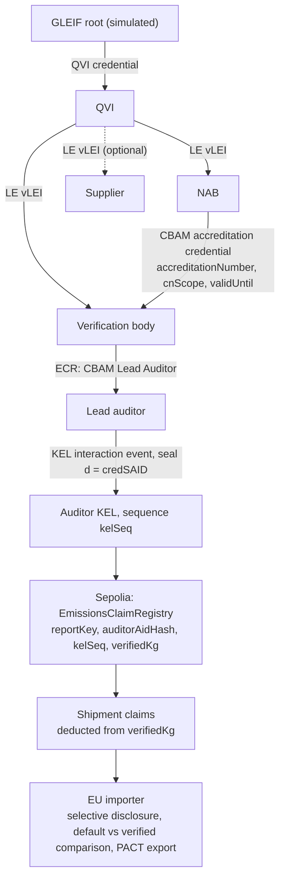
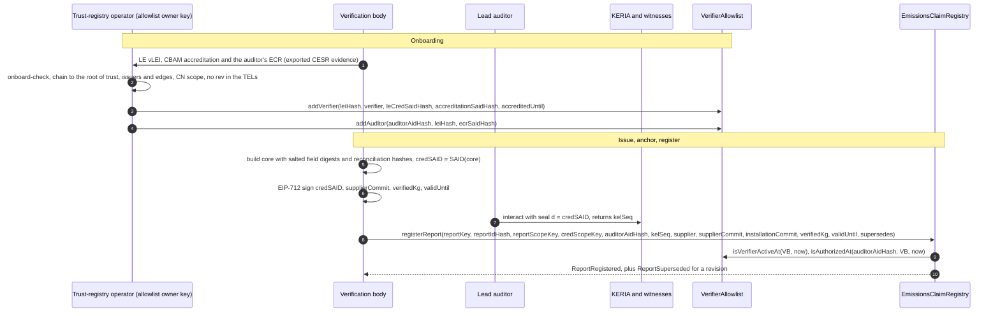
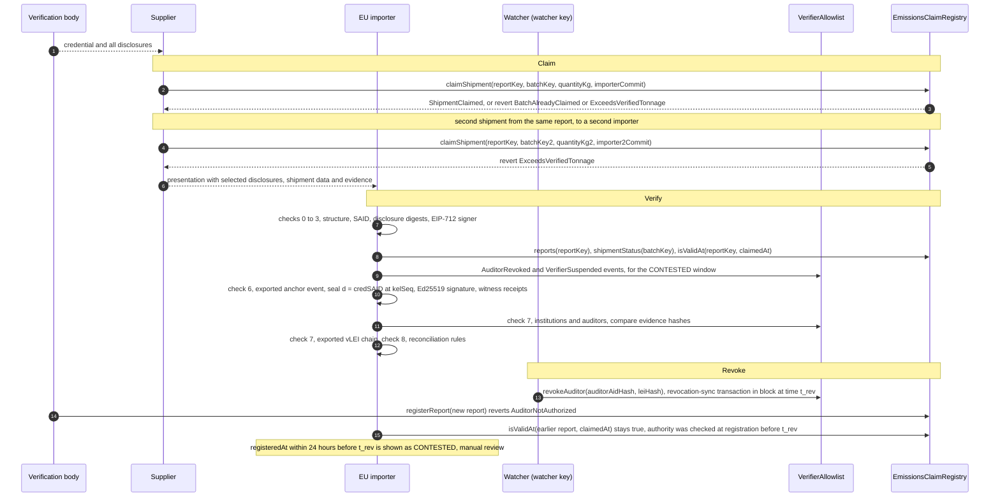

# Architecture

CarbonLEI answers three questions about a CBAM verification report:

1. Who is authorised to sign this number?
2. Is that authority still valid?
3. Has this tonnage already been used?

**At a glance.** The chain is used only for what no single party's database can enforce: one report per installation and reporting period across verification bodies, and one cumulative tonnage cap across importers; the allowlist operator is still partly trusted (§1.1). vLEI and KERI tie a signature to an accredited legal entity and a named lead auditor, the signed credential travels with the supplier and discloses only the fields it chooses, and the Sepolia contracts keep the shared tonnage ledger and the revocation status. The hosted page runs checks 1–3 and 6–8 in the browser and checks 4–5 against Sepolia; checks 6 and 7 read vLEI evidence exported from a local KERI run, labelled as such. The local mode reproduces the contracts, the scenario and the KERI run (KERIA, witnesses, vLEI credential chain); see [VLEI_SETUP.md](VLEI_SETUP.md).

This document describes why a blockchain is used at all (four questions), what each layer does that no other layer can, the components, the data flow, what goes on-chain and why, the trust chain, the identifier strategy and the two run modes. Status: implemented and deployed on Sepolia. Function signatures, errors, events and storage below are taken from `contracts/src/`; the verification steps and failure codes from `sdk/verify.ts`.

All companies, people and LEIs are fictional. Emissions values are illustrative — not official CBAM methodology.

---

## 1. Design principles

1. **Layered.** P0 is EIP-712 signatures plus on-chain rules; the contracts and verification checks 1–5 do not depend on KERI. P1 adds vLEI role authority and the KEL anchor (checks 6 and 7). A proof without KEL anchor or vLEI evidence fails checks 6 and 7 (`ANCHOR_NOT_FOUND`, `AUTHORITY_INVALID`); a verifier that has no vLEI checker reports those checks as skipped instead.
2. **Only hashes and status on-chain.** No trade secrets and no personal data go on-chain, because anything written to a public chain stays readable by everyone for good.
3. **One identifier end to end.** The report credential's SAID (`credSAID`, a Blake3-256 self-addressing identifier starting with `E`) is used in the KEL seal, in the EIP-712 signature and, hashed, as the on-chain key.
4. **The chain orders transactions, not KEL events.** KERI orders the events inside one KEL, but two KELs share no clock. CarbonLEI does not claim to order KEL events. Block time orders two on-chain transactions: the one that registered a report and the one in which the watcher synced a revocation. CarbonLEI compares those two block timestamps.

### 1.1 Why a blockchain: four questions

We use a ledger only if all four answers are yes, and then only for commitments. If any answer is no, a signed database is enough. One of our answers is only partly yes, and we say where.

| Question | Our answer | What follows from it |
|---|---|---|
| Are there multiple parties? | Yes. The accreditation body (NAB), verification bodies, lead auditors, suppliers and several EU importers. They do not share one database, and none of them runs the others' systems. | Every party reads and writes the same record without asking another party for access. |
| Is there no trusted operator? | **Partly.** In the prototype, one trust-registry operator writes the allowlist. It holds two keys: the allowlist owner key adds verification bodies and auditors, and a separate watcher key (holding only the WATCHER role) can only suspend a body, lift a suspension or revoke an auditor. The allowlist owner key can also replace any body's current address, and the new address can then register reports in that body's name (SECURITY.md T10). The owner also administers the WATCHER role: the contract lets only the owner hold `DEFAULT_ADMIN_ROLE` and moves that role with ownership, so the owner can grant or revoke the WATCHER role, including to itself. The two-key split therefore limits what a stolen watcher key can do, not what the owner can do. Neither key can change a registered report, its registration time or the tonnage ledger. Every allowlist entry carries evidence hashes, and check 7 compares them with the vLEI credentials it re-verifies off-chain, so a wrong entry can be detected; every address rotation emits a public event, and a report registered through a replaced address fails check 6 unless one of that body's auditors anchored it in their KEL. The tonnage ledger shared across importers is the part that no single party is trusted to keep. | The operator's power is limited and visible, not removed. Roadmap: replace the single owner with a multisig of accreditation bodies or a governance process, and accept an address rotation only if the old address or the body's vLEI signs it. |
| Must an auditor verify the history later? | Yes. Competent authorities can review a CBAM declaration after it is filed [8]. They need to see whether a report was registered before or after its auditor's authority was revoked, and how much tonnage was claimed for each importer. | Registration times, revocation-sync times and every claim stay public and cannot be rewritten. |
| Does the data fit a ledger? | Yes, as long as only commitments go on-chain: hashes, status, tonnage, and the addresses of the supplier and the verification body. Report fields and vLEI credentials stay off-chain. Tonnage is stored in clear; this is a residual risk disclosed in SECURITY.md §7. | See §6 for what goes on-chain and why. |

Why not a signed database: no single verification body's or importer's database can stop the same tonnage from being claimed for two different importers. Nor can it stop a second verification body from registering a report for the same installation and reporting period. A database run jointly for all of them could enforce both as well, but every party would have to trust its operator; a shared ledger enforces both without one party keeping the record (the allowlist operator is still partly trusted, §1.1): one report per installation and period across verification bodies, and one cumulative tonnage cap across importers.

### 1.2 What each layer does that no other layer can

| Layer | What only this layer does | What it does not do |
|---|---|---|
| vLEI and KERI (off-chain) | Ties a signature to a legal entity and a named role ("CBAM Lead Auditor") that chains up to the root of trust (a simulated GLEIF root in the demo), with issuance and revocation recorded in the issuer's KEL and TEL. The KEL anchor shows that the ECR holder, not just a wallet, endorsed this exact `credSAID`. | Gives no common clock across KELs. Cannot stop the same tonnage from being claimed twice. |
| Signed credential (SAID, salted digests, EIP-712) | Travels with the supplier. Any importer can check the issuer's signature without a chain (check 3), and sees only the fields the supplier chose to disclose. | Cannot show that the report was revoked later, or how much tonnage is left. |
| Chain (Sepolia contracts) | Keeps one record that no single verification body or importer controls: single-use tonnage shared across importers (a claim for a second importer beyond `verifiedKg` reverts with `ExceedsVerifiedTonnage`), public revocation status, and the order of the registration and revocation-sync transactions. It also keeps one report per installation and reporting period across verification bodies: a new report must supersede the previous one (`PeriodAlreadyCovered`), and the claimed tonnage carries over to the revision (`SupersedeOverClaimed`). No single verification body's or importer's database can do either. | Does not verify KERI signatures. Does not judge whether the emissions number is right. Does not order KEL events. |
| PACT export | Hands the result over in an existing industry data model (PACT v3 `ProductFootprint`), with the evidence in a declared extension, so importers do not need a new data model. | Does not carry live status; a consumer checks revocation on-chain. |
| Report–credential consistency (check 8) | Rule-based layer: compares what the signed verification report says with the credential and checks it against the regulation. Its three hashes sit inside the credential core, so they are covered by the SAID that the verification body signs (EIP-712) and the lead auditor anchors in their KEL; it is not an unsigned model output. | Uses no AI model. Only warns; never fails a credential. Does not show that the measured emissions are correct. |

---

## 2. Roles

| Role | Fictional actor | Holds | Does |
|---|---|---|---|
| GLEIF root | Demo Root Authority (fictional): a simulated GLEIF root on local test keys, not GLEIF's production root | Root AID | Issues the QVI credential |
| QVI | Demo QVI (fictional), LEI `ZZZZ00QVIISSRDEMO116` | QVI credential | Issues Legal Entity (LE) vLEIs |
| National accreditation body (NAB) | Demo Accreditation Body (fictional), LEI `ZZZZ00NABACCRDEMO119` | LE vLEI | Issues the CBAM accreditation credential to verification bodies |
| Verification body | Demo Verification GmbH (fictional), LEI `ZZZZ00EUVERIFDEMO152`, accreditation `DEMO-ACC-CBAM-0001` for CN 7318 | LE vLEI, CBAM accreditation credential, EVM wallet | Issues ECRs to its lead auditors; signs and registers reports |
| Lead auditor | Lena Demo (fictional person) | ECR (`engagementContextRole: "CBAM Lead Auditor"`), KERI AID | Anchors reports in their own KEL |
| Supplier (third-country operator) | Demo Fasteners Co. (fictional), Kaohsiung, LEI `ZZZZ00TWSCREWDEMO185` | LEI and EVM wallet. An LE vLEI is optional: only verification bodies and lead auditors need vLEIs (and an accreditation body, if it issues the accreditation credential itself). The demo setup still issues one to the supplier; no check uses it. | Claims shipments; chooses which fields to disclose |
| EU importer (CBAM declarant) | Demo Imports B.V. (fictional), LEI `ZZZZ00EUIMPRTDEMO148`, EORI `NLDEMO000000001` | EORI | Verifies presentations |
| Second EU importer (CBAM declarant) | Demo Schrauben Import GmbH (fictional), LEI `ZZZZ00EUIMPRTDEMO245`, EORI `DEDEMO000000002` | EORI | Would receive a second shipment from the same report. The claim for it exceeds the remaining tonnage and reverts with `ExceedsVerifiedTonnage`, which shows that the tonnage ledger is shared across importers. |
| Trust-registry operator | Project team in the prototype | Allowlist owner key | After off-chain checks (`verifier/src/onboard-check.ts`), writes assertions to the allowlist: adds verification bodies and auditors, each entry with the evidence hashes it relied on. Cannot change reports, registration times or the tonnage ledger. |
| Watcher | Project team in the prototype | Watcher key (WATCHER role), a separate address from the allowlist owner key | Syncs revocations to the allowlist with `suspendVerifier`, `liftSuspension` and `revokeAuditor`; these calls require the WATCHER role. In the prototype, `verifier/src/watch.ts` polls the verification body's KEL for the ECR revocation and sends `revokeAuditor` through `scripts/demo-scenario.ts`; suspensions, including attack 4's, are sent manually with the watcher key. |
| Impostor | Demo Impostor Verifier (fictional), LEI `ZZZZ00FAKEVERFICT143` | EVM wallet. In the demo chain: no LE vLEI, no accreditation. In attack 4: a vLEI chain of its own under a root it controls (Self-Made Root → Self-Made QVI → LE vLEIs; Self-Made Accreditation Body → accreditation; ECR `CBAM Lead Auditor` for its auditor; all fictional) | The onboarding check refuses it (`onboard-check.ts impostor`). Attack 4 simulates a stolen allowlist owner key that skips that check: on Sepolia the allowlist owner key added the body and its auditor to the allowlist, and the contract accepted the impostor's report for a fictional second installation (Demo Bolt Works Plant 1), because it checks the allowlist, not vLEI facts. Check 7 rejects the proof (`AUTHORITY_INVALID`). The watcher then suspended the body (a manual step in the demo), so a new `registerReport` from its address reverts with `NotActiveVerifier` (§9.1). The Trust chain tab shows it. It is the fourth demonstrated attack, after a tampered input (`DISCLOSURE_TAMPERED`), a claim for a second importer beyond the verified tonnage (`ExceedsVerifiedTonnage`) and a report by a revoked auditor (`AuditorNotAuthorized`). |

---

## 3. Components

| Component | Technology | Responsibility |
|---|---|---|
| `contracts/src/VerifierAllowlist.sol` | Solidity 0.8.28, Foundry, OpenZeppelin `Ownable` and `AccessControl` | Registry of verification bodies keyed by LEI hash (current address, LE and accreditation SAID hashes, `accreditedUntil`, most recent suspension) and of auditors keyed by (AID hash, LEI hash) (ECR SAID hash, revocation time). `isAuthorizedAt(auditorAidHash, verifier, t)`. Each entry is the trust-registry operator's assertion plus the evidence hashes it relied on. Two roles with separate keys: owner (adds entries and rotates addresses) and WATCHER (can only suspend a body, lift a suspension or revoke an auditor). Read interface `credentialRecord(address)`, which resolves the address to its institution; no verification check uses it (see §6). |
| `contracts/src/EmissionsClaimRegistry.sol` | Solidity 0.8.28, Foundry | Credential registry keyed by `reportKey = keccak256(bytes(credSAID))`, one entry per credential (§7); report-level and credential-level scope keys; tonnage ledger; batch uniqueness; report revocation; `isValid`, `isValidAt`, `shipmentStatus`, `remainingKg`. |
| `sdk/` | TypeScript, viem, @noble, vitest | Credential model and SAID (`said.ts`, `credential.ts`, `disclosure.ts`), keys and commitments (`commitment.ts`), EIP-712 (`eip712.ts`), issuance (`issue.ts`), on-chain reads and dry runs (`chain.ts`), the verification pipeline (`verify.ts`, shared by the hosted page and the CLI), vLEI evidence checks (`vlei.ts`, `checkers.ts`), report reconciliation (`consistency.ts`), PACT v3 export (`pact.ts`) and the CLI (`cli.ts`: `issue`, `present`, `verify`, `export-pact`; it never sends transactions). |
| `verifier/` | Docker Compose, KERIA, signify-ts | Local KERI stack (`docker-compose.yaml`) and the scripts that build and export the vLEI evidence: `setup` (eight agents and the credential chain), `anchor` (KEL interaction event sealing a `credSAID`), `export-evidence`, `build-authority-bundle`, `status` (read-only health check), `onboard-check` (onboarding gate before `addVerifier` / `addAuditor`), and `scripts/build-schema.ts` (the accreditation schema). See [VLEI_SETUP.md](VLEI_SETUP.md). |
| `scripts/` | Node.js 22 | `demo-scenario.ts` sends the onboarding, registration, claim, revocation-sync, attack 3 and attack 4 transactions and records them in `fixtures/<network>-tx.json`; `demo-local.ts` runs the whole scenario on a local anvil chain; `build-demo-data.ts` builds the hosted page's data. |
| `demo/` | React 19, Vite 8, GitHub Pages | Verification body, Supplier, Buyer, Try to break it, Trust chain and On-chain proof tabs. |
| `fixtures/` | JSON, CESR | Fictional companies and LEIs (`demo.json`), the vLEI identifiers (`vlei.json`), exported vLEI and KEL evidence (`evidence/`), the demo credentials and the recorded Sepolia transactions (`sepolia-tx.json`). |

Pinned versions: KERIA `weboftrust/keria:0.4.0`, witnesses `weboftrust/keri:1.2.13` and schema server `gleif/vlei:1.0.3` in `verifier/docker-compose.yaml`; `signify-ts` 0.4.0 in `verifier/package.json`; Node.js 22.20.0 in `.nvmrc`.

---

## 4. Trust chain

Why each link exists:

| Link | Reason |
|---|---|
| LE vLEI of the verification body | CBAM verifiers are legal persons accredited by an EU NAB [2] |
| NAB accreditation credential | Accreditation is issued, suspended and withdrawn by the NAB; certificates last at most five years [2]. The credential uses a custom ACDC schema ("CBAM Verifier Accreditation Credential (demo)", `verifier/schemas/cbam-verifier-accreditation.json`) and chains through its `nab` edge to the NAB's own LE vLEI |
| ECR of the lead auditor | The verification report must carry the "date and signature by an authorised person on behalf of the verifier, including his/her name" [3] |
| KEL anchor | Proves the ECR holder, not just a wallet, endorsed this exact credential. Closes the gap "EVM address ≠ ECR holder" |
| On-chain record | Public status; the order of the registration and revocation-sync transactions; single-use tonnage shared across importers |

---

## 5. Data flow

The flow is split into two diagrams: onboarding and issuance, then claim, verification and revocation.

**Onboard, issue, anchor, register**

**Claim, verify, revoke**

In both diagrams, a verification body's allowlist entry is keyed by `leiHash`; `verifier` is the body's current address. In the prototype the owner's and the watcher's transactions are sent by `scripts/demo-scenario.ts`. The ECR is revoked in the body's KEL with `verifier/src/revoke-ecr.ts`, and `verifier/src/watch.ts` detects the revocation by polling the body's KEL through the witnesses and then runs the `revokeAuditor` step automatically; suspensions are sent manually with the watcher key.

### 5.1 Contract interface

Each table lists the function and its parameters, who may call it, the errors it reverts with (in the order the contract checks them), and what it does. Error parameters are listed under Errors below.

**VerifierAllowlist** (owner = trust-registry operator; WATCHER = a separate watcher key that can only suspend a body, lift a suspension or revoke an auditor). `constructor(initialOwner, watcher)` grants `WATCHER_ROLE` to `watcher` (zero address: `InvalidInput`). `DEFAULT_ADMIN_ROLE`, which administers `WATCHER_ROLE`, can only be held by the owner: `_grantRole` reverts with `InvalidInput` for any other account, and `_transferOwnership` moves the role to the new owner. The owner can therefore grant or revoke the WATCHER role, so the split limits what a stolen watcher key can do, not what the owner can do. The standard OpenZeppelin functions (`owner`, `transferOwnership`, `renounceOwnership`, `grantRole`, `revokeRole`, `renounceRole`, `hasRole`, `getRoleAdmin`) are inherited.

| Function | Caller | Reverts | Purpose |
|---|---|---|---|
| `addVerifier(VerifierInput)`, with `VerifierInput` = `leiHash`, `verifier` (the body's first current address), `leCredSaidHash`, `accreditationSaidHash`, `accreditedUntil` (`uint64`) | owner | `OwnableUnauthorizedAccount`; `InvalidInput` (zero `leiHash`, `leCredSaidHash`, `accreditationSaidHash` or `verifier`); `VerifierExists`; `AddressAlreadyBound`; `InvalidExpiry` (`accreditedUntil` not in the future) | Records the owner's assertion after an off-chain check of the LE vLEI and accreditation, with SAID hashes that let anyone re-verify the entry against the evidence. |
| `rotateVerifierAddress(leiHash, newAddr)` | owner | `OwnableUnauthorizedAccount`, `VerifierNotFound`, `InvalidInput` (zero `newAddr`), `AddressAlreadyBound` | Makes `newAddr` the institution's current address. The old address keeps its binding with `unboundAt` set, so it can no longer act but reports it registered still resolve; suspension and accreditation fields are not touched. The body does not have to agree, so the allowlist owner key can register reports in any body's name through a new address (SECURITY.md T10). |
| `addAuditor(AuditorInput)`, with `AuditorInput` = `auditorAidHash`, `leiHash`, `ecrSaidHash` | owner | `OwnableUnauthorizedAccount`; `VerifierNotFound`; `NotActiveVerifier` (the institution is not active now; the error carries its current address); `InvalidInput` (zero `auditorAidHash` or `ecrSaidHash`); `AuditorExists` | Records the owner's assertion after an off-chain check of the ECR (issuer = that body, role = `CBAM Lead Auditor`) for an institution that is active now; the stored ECR SAID hash lets anyone re-verify the entry. |
| `suspendVerifier(leiHash)` | WATCHER role | `AccessControlUnauthorizedAccount`, `VerifierNotFound`, `AlreadySuspended` | Starts a suspension of the institution, for example after the NAB withdraws its accreditation; it overwrites the previous suspension interval. |
| `liftSuspension(leiHash)` | WATCHER role | `AccessControlUnauthorizedAccount`, `VerifierNotFound`, `NotSuspended` | Ends the institution's current suspension. |
| `revokeAuditor(auditorAidHash, leiHash)` | WATCHER role | `AccessControlUnauthorizedAccount`, `AuditorNotFound`, `AlreadyRevoked` | Mirrors a revoked ECR. There is no function that restores a revoked auditor, and `addAuditor` reverts with `AuditorExists` for the same (AID, institution). |
| `isInstitutionActiveAt(leiHash, t)` | view | — | True if the institution was added at or before `t`, `t ≤ accreditedUntil`, and `t` lies outside its most recent suspension interval `[suspendedAt, liftedAt)`. |
| `isVerifierActiveAt(verifier, t)` | view | — | True if at `t` the address was bound to an institution and not yet rotated away (`boundAt ≤ t < unboundAt`), and that institution was active at `t`. |
| `isAuthorizedAt(auditorAidHash, verifier, t)` | view | — | True if `isVerifierActiveAt(verifier, t)` holds and the auditor was added under the institution the address is bound to at or before `t` and not revoked at `t`. Auditors are keyed by (AID hash, `leiHash`), not by address, so an address rotation does not affect them. |
| `credentialRecord(verifier)` | view | — | `(credType, expiresAt, credHash)` = (`CRED_TYPE_LE` = `keccak256("vLEI/LE")`, `accreditedUntil`, `leCredSaidHash`) of the institution the address is currently bound to; all zero if the address is not, or no longer, that institution's current address. No verification check uses it; its field layout is explained under Related designs in §6. |
| `institutions(leiHash)` | view (public getter) | — | `currentAddress`, `leCredSaidHash`, `accreditationSaidHash`, `accreditedUntil`, `addedAt`, `suspendedAt`, `liftedAt`. |
| `leiOfAddress(addr)` | view (public getter) | — | `leiHash`, `boundAt`, `unboundAt` (0 while the address is the institution's current address). |
| `auditors(auditorAidHash, leiHash)` | view (public getter) | — | `ecrSaidHash`, `addedAt`, `revokedAt` (0 = not revoked). |

**EmissionsClaimRegistry** (`constructor(allowlist)`; zero address: `InvalidInput`; public getter `allowlist()`).

`ReportInput` has twelve fields: `reportKey`, `reportIdHash`, `reportScopeKey`, `credScopeKey`, `auditorAidHash`, `kelSeq` (`uint64`), `supplier`, `supplierCommit`, `installationCommit`, `verifiedKg` (`uint96`), `validUntil` (`uint64`) and `supersedes` (zero when there is none). The SDK computes every key off-chain (§6); the contract receives only `bytes32` values.

| Function | Caller | Reverts | Purpose |
|---|---|---|---|
| `registerReport(ReportInput)` | the current address of an active verification body | `NotActiveVerifier`, `AuditorNotAuthorized`, `ReportExists`, `ZeroQuantity`, `InvalidExpiry`, `InvalidInput`, `ReportIdRetired`, `ReportNotFound`, `NotReportIssuer`, `PeriodAlreadyCovered`, `CredScopeAlreadyCovered`, `SupersedeMismatch`, `SupersedeOverClaimed` (order below) | Registers one credential under an auditor authorised now, binds its report to the installation and reporting period, and optionally supersedes an earlier credential (rules below). |
| `claimShipment(reportKey, batchKey, quantityKg, importerCommit)` | the report's `supplier` | `ReportNotFound`; `ReportInvalid` (`isValid(reportKey)` is false now); `NotSupplier`; `BatchAlreadyClaimed`; `ZeroQuantity`; `ExceedsVerifiedTonnage` | Claims a batch against a currently valid credential, within its `verifiedKg` minus the quantity already claimed in its credential layer. |
| `revokeReport(reportKey)` | the issuing institution, through its current address, while it is active (not suspended, accreditation not expired) | `ReportNotFound`; `AlreadyRevoked`; `NotActiveVerifier` (the caller is not an active institution's current address, for example suspended, expired or rotated out); `NotReportIssuer` (the caller's institution did not issue the report) | Revokes the credential immediately, for all its shipments; neither key layer is released. |
| `reports(reportKey)` | view | — | The full `ReportRecord` struct (all fields zero if never registered): `verifier` (the registering address), `issuerLeiHash`, `auditorAidHash`, `kelSeq`, `supplier`, `supplierCommit`, `installationCommit`, `verifiedKg`, `validUntil`, `registeredAt`, `revokedAt`, `reportIdHash`, `reportScopeKey`, `credScopeKey`, `supersedes`, `supersededBy`. The storage mapping itself is internal. |
| `isValid(reportKey)` | view | — | `isValidAt(reportKey, block.timestamp)`. |
| `isValidAt(reportKey, t)` | view | — | Whether the credential was valid at time `t` (definition below). |
| `shipmentStatus(batchKey)` | view | — | `reportKey`, `quantityKg`, `importerCommit`, `verifier` (the address that registered the report), `claimedAt` and `reportValid` (definition below). |
| `remainingKg(reportKey)` | view | — | `verifiedKg` minus the cumulative `claimedKg` of the credential's layer, if the credential is that layer's latest and not revoked; otherwise `0`. It does not look at expiry or at report-level replacement; `claimShipment` also requires `isValid`. |
| `shipments(batchKey)` | view (public getter) | — | `reportKey`, `quantityKg`, `importerCommit`, `claimedAt`. |
| `reportScopes(reportScopeKey)` | view (public getter) | — | Report layer: `reportIdHash` (the bound report ID; never reset to zero), `latestReportKey`, `boundAt` (first binding). |
| `credScopes(reportScopeKey, credScopeKey)` | view (public getter, two keys) | — | Credential layer: `claimedKg` (cumulative, never decreases) and `latestReportKey`. The ledger is keyed by the report scope and the credential scope together, so a credential layer cannot be occupied under an unrelated report scope. |
| `reportIdUnboundAt(reportScopeKey, reportIdHash)` | view (public getter, two keys) | — | When a revision moved that report ID off that report scope (0 = never). |

**`registerReport` checks, in order.** The first failing check reverts.

1. The caller is the current address of an active institution: `isVerifierActiveAt(caller, now)` (`NotActiveVerifier`).
2. The auditor is authorised now: `isAuthorizedAt(auditorAidHash, caller, now)` (`AuditorNotAuthorized`). This is the only authority check; it is not repeated later.
3. `reportKey` is not registered (`ReportExists`).
4. `verifiedKg` is above zero (`ZeroQuantity`).
5. `validUntil` is later than now (`InvalidExpiry`).
6. None of `reportKey`, `supplier`, `reportScopeKey`, `credScopeKey`, `reportIdHash` is zero (`InvalidInput`).
7. The report ID has not been moved off this report scope by an earlier revision (`ReportIdRetired`).
8. A non-zero `supersedes` names a registered credential (`ReportNotFound`).
9. **Report layer** (`reportScopes[reportScopeKey]`):
   - unbound: passes;
   - bound to the input `reportIdHash`: the caller's institution must be the one that registered the scope's latest credential (`NotReportIssuer`), so another institution that takes over uses a new verification report ID;
   - bound to another report ID: `supersedes` must be non-zero and name a credential of the bound report ID (`PeriodAlreadyCovered`). Revocation does not release the binding.
10. **Credential layer** (`credScopes[reportScopeKey][credScopeKey]`), one of three branches:
    - **(a) No supersession** (`supersedes` zero): the layer must be empty (`CredScopeAlreadyCovered`).
    - **(b) Revision in the same layer** (`supersedes` non-zero, layer not empty): `supersedes` must be the layer's latest credential, whether valid or revoked, and belong to the same `reportScopeKey` (`SupersedeMismatch`); the issuer rule must hold (`NotReportIssuer`); the new `verifiedKg` must not be below the layer's `claimedKg` (`SupersedeOverClaimed`). The superseded credential gets `supersededBy`, the claimed quantity carries over, and `ReportSuperseded` is emitted.
    - **(c) Report-level takeover** (`supersedes` non-zero, layer empty): the named credential must not be superseded, must belong to the same `reportScopeKey`, and the input `reportIdHash` must differ from the bound one (`SupersedeMismatch`); the issuer rule must hold (`NotReportIssuer`). The report scope moves to the new report ID through a new, empty credential layer. The named credential gets no `supersededBy` and stays its own layer's latest credential with its `claimedKg` unchanged; it stops validating because its report ID was moved off the scope, so that layer is frozen until a revision under branch (b) names it, under the same issuer rule. No `ReportSuperseded` event is emitted.
    - **Issuer rule** for (b) and (c): the caller's institution issued the named credential, or that institution is not active now (suspended, or its accreditation expired).

Effects of a successful registration: the record is stored with `registeredAt` = block time and `issuerLeiHash` = the caller's institution. If the report scope was unbound it is bound to the input report ID; if it was bound to another ID, `reportIdUnboundAt[reportScopeKey][old ID]` is set to now and the scope is rebound, so every credential of the old report stops validating from that moment, including credentials in other layers that nothing superseded directly. The new credential becomes the latest of its report scope and of its credential layer, and `ReportRegistered` is emitted.

Validity: `isValidAt(reportKey, t)` is true if and only if the credential is registered and `registeredAt ≤ t`; it is not revoked (revocation applies whatever `t` is); `t ≤ validUntil`; it is not superseded, or `t` is earlier than the registration of the credential that superseded it; and its report ID is still the one bound to its `reportScopeKey`, or `t` is earlier than the time the binding moved (`reportIdUnboundAt`). Authority is not re-evaluated: `registerReport` already required `isAuthorizedAt(auditorAidHash, caller, now)`, so later suspensions, address rotations or auditor revocations do not change the answer for a credential that is already registered. Check 4 passes a shipment's `claimedAt` as `t`, so a shipment claimed before expiry still verifies when the declaration is filed the following year.

`shipmentStatus` returns `reportValid` = "the batch was claimed and the report is not revoked". The claim was checked with `isValid` when it was made; afterwards only revocation turns `reportValid` false, immediately, for every shipment of the report. Supersession, expiry and later authority changes do not invalidate shipments claimed earlier.

Events (OpenZeppelin's ownership and role events are emitted by the library and not listed; indexed fields are marked *):

| Event | Emitted by | Fields |
|---|---|---|
| `VerifierAdded` | `addVerifier` | `leiHash`*, `verifier`*, `accreditedUntil`, `accreditationSaidHash` |
| `VerifierSuspended` | `suspendVerifier` | `leiHash`*, `suspendedAt` |
| `SuspensionLifted` | `liftSuspension` | `leiHash`*, `liftedAt` |
| `VerifierAddressRotated` | `rotateVerifierAddress` | `leiHash`*, `oldAddr`*, `newAddr`*, `rotatedAt` |
| `AuditorAdded` | `addAuditor` | `auditorAidHash`*, `leiHash`*, `ecrSaidHash` |
| `AuditorRevoked` | `revokeAuditor` | `auditorAidHash`*, `leiHash`*, `revokedAt` |
| `ReportRegistered` | `registerReport` | `reportKey`*, `verifier`*, `supplier`*, `issuerLeiHash`, `reportScopeKey`, `credScopeKey`, `reportIdHash`, `auditorAidHash`, `kelSeq`, `verifiedKg`, `validUntil` |
| `ReportSuperseded` | `registerReport` under branch (b) only, after `ReportRegistered` in the same transaction | `oldReportKey`*, `newReportKey`*, `credScopeKey`*, `carriedClaimedKg` (the claimed tonnage carried over), `newVerifiedKg` |
| `ReportRevoked` | `revokeReport` | `reportKey`*, `verifier`* (the caller, the institution's current address), `revokedAt` |
| `ShipmentClaimed` | `claimShipment` | `batchKey`*, `reportKey`*, `supplier`*, `quantityKg`, `importerCommit`, `cumulativeClaimedKg`, `claimedAt` |

Errors (custom errors and their parameters):

| Contract | Errors |
|---|---|
| `VerifierAllowlist` | `InvalidInput()`, `InvalidExpiry(uint64 validUntil)`, `VerifierExists(bytes32 leiHash)`, `VerifierNotFound(bytes32 leiHash)`, `AddressAlreadyBound(address addr)`, `NotActiveVerifier(address verifier)`, `AuditorExists(bytes32 auditorAidHash, bytes32 leiHash)`, `AuditorNotFound(bytes32 auditorAidHash, bytes32 leiHash)`, `AlreadyRevoked(bytes32 key)` (carries the auditor AID hash), `AlreadySuspended(bytes32 leiHash)`, `NotSuspended(bytes32 leiHash)`; from OpenZeppelin: `OwnableUnauthorizedAccount(address account)`, `OwnableInvalidOwner(address owner)`, `AccessControlUnauthorizedAccount(address account, bytes32 neededRole)` |
| `EmissionsClaimRegistry` | `NotActiveVerifier(address verifier)`, `AuditorNotAuthorized(bytes32 auditorAidHash, address verifier)`, `ReportExists(bytes32 reportKey)`, `ZeroQuantity()`, `InvalidExpiry(uint64 validUntil)`, `InvalidInput()`, `ReportIdRetired(bytes32 reportScopeKey, bytes32 reportIdHash)`, `PeriodAlreadyCovered(bytes32 reportScopeKey, bytes32 currentReportIdHash)`, `CredScopeAlreadyCovered(bytes32 credScopeKey, bytes32 latestReportKey)`, `SupersedeMismatch(bytes32 expected, bytes32 given)`, `SupersedeOverClaimed(bytes32 credScopeKey, uint96 claimedKg, uint96 verifiedKg)`, `ReportNotFound(bytes32 reportKey)`, `ReportInvalid(bytes32 reportKey)`, `NotSupplier(address caller)`, `BatchAlreadyClaimed(bytes32 batchKey)`, `ExceedsVerifiedTonnage(uint96 remainingKg, uint96 requestedKg)`, `NotReportIssuer(address caller, bytes32 issuerLeiHash)`, `AlreadyRevoked(bytes32 key)` |

### 5.2 Credential and presentation

- **Disclosure** per field: `base64url(JSON.stringify([salt, name, value]))`, where `salt` is 32 random bytes as `0x` hex (the same length for `idSalt`, `batchSalt` and `importerSalt`). **Digest**: `base64url(sha256(disclosure))`.
- **Core**: `{ d, type, version, issuer: { verifierAddress, verifierLEI, auditorAID }, digests: [sorted], reconciliation: { inputHash, outputHash, ruleVersionHash }, issuedAt, validUntil }`, with `type` = `CBAM Embedded Emissions Credential` and `version` = `0.1.0`; `reconciliation` is optional. The core contains only strings, string arrays and nested objects, no JSON numbers or booleans, so its compact serialisation is identical across languages. `d` is a Blake3-256 self-addressing identifier (CESR code `E`) computed by `sdk/said.ts` over the compact, insertion-ordered JSON of the core with `d` replaced by 44 `#` characters; the SAID test vector in `fixtures/vectors.json` matches keripy 1.2.13 (`sdk/scripts/check-said-keripy.sh`). `d` is `credSAID`.
- **P0 signature**: EIP-712 `EmissionsCredential { string credSAID; bytes32 supplierCommit; uint96 verifiedKg; uint64 validUntil }`. Domain: name `CarbonLEI`, version `1`, chain ID (11155111 on Sepolia), `verifyingContract` = `EmissionsClaimRegistry` address (the version stays `1` across redeployments; only `verifyingContract` changes).
- **P1 anchor**: the auditor's agent runs `interact` with the seal `{ d: credSAID }` (`npm run -w verifier vlei:anchor -- <credSAID>`); the event's sequence number is passed to `registerReport` as `kelSeq`.
- **Presentation**: `{ core (the core as a JSON string), signature, disclosures: [selected by the supplier], shipment?: { batchId, quantityTonnes, shipmentDate, importerSalt }, anchorEvidence?, authorityEvidence?, reportExtract? }`. The last three are the inputs to checks 6, 7 and 8. `authorityEvidence` can be inline or a reference `{ bundle, sha256 }` to a bundle file, which the verifier loads and compares with the hash. The disclosures must include `supplierLEI`, `installationId`, `cnCode`, `cbamRoute`, `reportingPeriod`, `verifiedTonnes`, `verificationReportId`, `methodologyNote`, `idSalt` and `batchSalt`; without them checks 3 and 4 cannot recompute the signed values and the on-chain keys, and step 0 rejects the proof. The demo proof discloses 21 fields and hides 5 (`productionRoute`, `energyMix`, `supplierCost`, `operatorId`, `installationName`).

Field list: [PACT_MAPPING.md](PACT_MAPPING.md#1-credential-fields).

### 5.3 Verification pipeline (`sdk/verify.ts`)

`verifyPresentation(proof, reader, options)` runs steps 0–8. Every step runs even after a failure, so the result lists every failing check; only a malformed presentation (step 0) stops early.

| # | Check | Failure code | Hosted mode |
|---|---|---|---|
| 0 | Structure: the core parses and has its fields; every disclosure decodes to `[salt, name, value]`; the required fields are disclosed; `methodologyNote` is unchanged; values are in normal form; salts are 32-byte hex; a shipment part is complete | `PRESENTATION_MALFORMED` | in the browser |
| 1 | Recompute the SAID of the core; it equals `core.d` | `SAID_MISMATCH` | in the browser |
| 2 | Every disclosure digest is in `core.digests`, and no field is disclosed twice | `DISCLOSURE_TAMPERED` | in the browser |
| 3 | The EIP-712 signer, over `credSAID`, the `supplierCommit` recomputed from the disclosed `supplierLEI` and `idSalt`, `verifiedKg` from `verifiedTonnes` and `validUntil`, equals `core.issuer.verifierAddress` | `BAD_SIGNATURE` | in the browser, with the chain ID read from the node |
| 4 | On-chain record of `reportKey = keccak256(bytes(credSAID))`, evaluated at `t` = the shipment's `claimedAt` (or, without a shipment, the timestamp of block B, the latest block when verification starts); sub-checks below | `REPORT_INVALID/NOT_REGISTERED`, `/REVOKED`, `/SUPERSEDED`, `/EXPIRED`, `/REGISTRANT_MISMATCH`, `/ISSUER_MISMATCH`, `/SUPPLIER_MISMATCH`, `/SCOPE_MISMATCH`, `REPORT_INVALID`; passes with `CONTESTED` | live against Sepolia |
| 5 | `shipmentStatus(batchKey)`, with `batchKey = keccak256(abi.encode(reportKey, batchId, batchSalt))`: the batch was claimed against this report, the quantity matches, `importerCommit` equals `keccak256(abi.encode(importerEORI, importerSalt))` recomputed from the verifier's own EORI, and the report has not been revoked since the claim. Skipped without a shipment or without the verifier's EORI | `SHIPMENT_MISMATCH` | live against Sepolia |
| 6 | (P1) The anchor event is an interaction event (`ixn`) by the credential's auditor AID, whose hash equals the on-chain `auditorAidHash`, at sequence number `kelSeq` from the on-chain record; its seals contain `{ d: credSAID }`; its SAID recomputes and its size matches its version string; its Ed25519 signature verifies over the exact event bytes; the evidence must include the auditor's inception event, whose SAID recomputes, whose prefix is the auditor's AID, and whose key is the signing key; the anchor event and the inception event each carry Ed25519 signatures over their exact bytes from at least the inception's witness threshold (`bt`) of the witnesses it names (`b`), as indexed witness signatures or receipt couples, where a duplicate or a key outside the list does not count. The witness list is the inception's: rotations between the inception and the anchor are not walked, so such an anchor fails closed | `ANCHOR_NOT_FOUND` | in the browser, on the exported anchor event |
| 7 | (P1) From exported CESR streams: the ECR, the body's LE vLEI, the QVI credential, the accreditation and the NAB's LE vLEI each recompute their SAID, have a TEL issuance event with no revocation, and are anchored in the issuer's KEL by an event the issuer signed (`sdk/kel.ts`, root first: the issuance event's SAID and registry, the seal in the issuer's KEL, and the issuer's KEL from its self-addressing inception to the anchoring event, with each event's SAID, size, sequence number, prior-event link and Ed25519 controller signature, and pre-rotation for rotations; on every event walked, Ed25519 signatures over its exact bytes from at least `bt` distinct witnesses of the witness list in force at that event: the inception's `b`, from which a rotation removes `br` and to which it appends `ba`, with `bt` read again; the registry is incepted by the issuer and anchored in the same KEL), so the QVI credential's anchor must be signed with the pinned root's inception key; the ECR is issued by the body to the auditor's AID with role `CBAM Lead Auditor` and the body's LEI, and chains to the body's LE vLEI; the body's LE vLEI chains to the QVI credential, whose issuer is compared first with the root of trust pinned in the verifier's configuration ("QVI credential not issued by the configured root of trust", the reason a chain built under another root gets in attack 4) and then with the root the bundle names (a bundle that names another root fails); the accreditation is issued by the NAB (chaining to the NAB's LE vLEI) to the same body, its `cnScope` includes the disclosed CN code, and it had not expired at registration; the on-chain allowlist hashes (`leCredSaidHash`, `accreditationSaidHash`, `ecrSaidHash`) equal the hashes of those credentials' SAIDs. The witness receipts are those in the presented evidence and no witness is queried; delegated identifiers and multi-key or weighted thresholds fail closed (SECURITY.md §4.1) | `AUTHORITY_INVALID` | in the browser, on exported evidence (`authority-bundle.json`, bound to the proof by its sha256), labelled as such |
| 8 | Report reconciliation (advisory): re-run the rules on the report extract and compare the three hashes with those in the core | `CONSISTENCY_WARNING/…` (a warning, never a failure) | in the browser |

Check 4 sub-checks (labels as in `sdk/verify.ts`); the first failing one gives the code, and the detail lists all of them:

- **4b** revoked (`/REVOKED`).
- **4d** superseded in the same layer at `t`, or the report scope moved to another report ID at `t` (`/SUPERSEDED`; the detail says when the issuing body changed). A shipment claimed in the same block as the replacement, while the report was still valid, is not failed.
- **4e** `t` is after `validUntil` (`/EXPIRED`).
- **4f** authorisation: not recomputed; the contract checked it at registration.
- **4g** the registering address equals `core.issuer.verifierAddress` (`/REGISTRANT_MISMATCH`).
- **4h** on-chain `auditorAidHash`, `verifiedKg` and `validUntil` equal the signed values (`/ISSUER_MISMATCH`).
- **4i** on-chain `supplierCommit` and `installationCommit` equal the values recomputed from the disclosed fields and `idSalt` (`/SUPPLIER_MISMATCH`).
- **4j** on-chain `reportScopeKey`, `credScopeKey` and `reportIdHash` equal the values recomputed from the disclosed fields (`/SCOPE_MISMATCH`).
- **4k** the local result agrees with the contract's own `isValidAt(reportKey, t)` and with `reportValid` (`REPORT_INVALID` otherwise).
- **4l** if nothing failed: **CONTESTED** when an `AuditorRevoked` event for this auditor and institution, or a `VerifierSuspended` event for the institution, falls within 24 hours after `registeredAt` (option `contestedWindowHours`, default 24). The page shows "Registered within 24 h before a revocation was synced on-chain — needs human review. Neither passed nor failed." and does not mark the report invalid.

All chain reads of a verification are pinned to one block: checks 4, 5 and 7 read block B for every view call, and 4l searches events up to B, so every check sees the same state. If B is before the contracts' deployment block, or B's timestamp is before the report's `registeredAt`, verification stops with an error ("RPC node is behind") instead of a result.

Overall result: `INVALID` if any check fails, otherwise `CONTESTED` if 4l flagged the report, otherwise `VALID`. Skipped checks and check 8 warnings do not change the result. Undisclosed fields are shown as "hidden by supplier". An unregistered credential fails with `REPORT_INVALID/NOT_REGISTERED`; there is no separate auditor-authorisation code, because the contract refuses to register a report from an auditor who is not authorised at that moment.

**Check 8: report–credential consistency (rule-based, `sdk/consistency.ts`).** When a credential is issued, before it is signed, a deterministic rule set (version `carbonlei-reconciliation/1`) compares the structured fields of the verification report (the report extract) with the credential and checks them against the regulation. The twelve rules are: quantity per CN code, specific embedded emissions per CN code, report ID, reporting period, installation, accreditation number, accreditation body, CN code within the accreditation scope, a physical site visit in the installation's first verified period, reasonable assurance, a 5% materiality threshold, and the date order (period start ≤ period end ≤ report signature ≤ credential issuance ≤ validity end). The run produces three keccak256 hashes over canonical JSON (sorted keys): `inputHash` over the extract and the credential fields, `outputHash` over the findings and `ruleVersionHash` over the rule version and rule names. The three hashes are part of the credential core, so the SAID and the signature cover them. At verification the importer re-runs the same rules on the extract it received: a hash difference gives `CONSISTENCY_WARNING/PROOF_MISMATCH`, a failing rule gives its own code (`/FIELD_MISMATCH`, `/CN_NOT_IN_SCOPE`, `/FIRST_YEAR_NOT_PHYSICAL`, `/ASSURANCE_NOT_REASONABLE`, `/MATERIALITY_NOT_5`, `/PERIOD_ORDER`). The check is skipped when the proof has no extract, the credential has no reconciliation hashes, or the fields the rules read are not disclosed. Check 8 only warns; checks 0–7 do not depend on it.

---

## 6. On-chain vs off-chain

| Data | Where | Why |
|---|---|---|
| vLEI credentials (LE, ECR, accreditation), KELs | Off-chain (KERI) | Credentials contain names and roles. KERI already provides key state, rotation and revocation. The EVM cannot verify Ed25519 KERI signatures cheaply, and signify-ts generates only Ed25519 keys natively; it can verify P-256 signatures and accept external key modules, but does not support secp256k1 [4] |
| Report fields (emissions, production process description, energy mix, cost) | Off-chain, held by supplier and verification body | Business-sensitive. Only disclosed fields reach the importer |
| `reportKey = keccak256(bytes(credSAID))` | On-chain | Public, non-guessable key. `credSAID` commits to salted digests |
| Auditor AID hash (`keccak256(bytes(AID))`), `kelSeq` | On-chain | Links the on-chain record to the KEL anchor |
| Supplier LEI and installation ID (`supplierCommit`, `installationCommit` = `keccak256(abi.encode(value, idSalt))`), batch ID (`batchKey` = `keccak256(abi.encode(reportKey, batchId, batchSalt))`), importer EORI (`importerCommit` = `keccak256(abi.encode(importerEORI, importerSalt))`) | On-chain as salted commitments | Needed for uniqueness and for the importer's checks; the salts travel only inside the presentation. See [SECURITY.md](SECURITY.md#7-privacy-of-on-chain-data) |
| Verification body LEI (`leiHash = keccak256(bytes(LEI))`), report ID (`reportIdHash = keccak256(bytes(verificationReportId))`) | On-chain, unsalted | Allowlist key and report-layer binding; verification bodies are public by design |
| `verifiedKg`, `claimedKg`, shipment `quantityKg` | On-chain in clear | The tonnage ledger must be enforceable by the contract |
| Allowlist status, `accreditedUntil`, suspension and revocation times, LE, accreditation and ECR SAID hashes | On-chain | Anyone can check authority at a given time. Each entry is the trust-registry operator's assertion plus evidence hashes; anyone can re-verify it against the evidence published in `fixtures/evidence/` (check 7 does). |
| Registration and revocation block timestamps | On-chain | Orders the registration and revocation-sync transactions. It does not order KEL events. |
| `reportScopeKey = keccak256(abi.encode(installationId, reportingPeriod))`; `credScopeKey = keccak256(abi.encode(installationId, cnCode, cbamRoute, reportingPeriod))` with its cumulative claimed quantity, stored under the pair (`reportScopeKey`, `credScopeKey`) (`cbamRoute` is the regulatory production-route code, a disclosed field; the free-text `productionRoute` stays hidden and is not part of any key) | On-chain, unsalted | Enforces across verification bodies the rule that one installation and reporting period has one verification report, replaced only by a revised report (Delegated Regulation (EU) 2025/2551, Annex II, point 2.17.3). The report-level key stays bound once used: revocation does not release it, and a new report ID needs `supersedes` (`PeriodAlreadyCovered`, `SupersedeMismatch`). A credential under the bound report ID, or a revision, must come from the same institution (`leiHash`) unless the earlier issuer is not active (suspended, or its accreditation expired); another institution that takes over uses a new verification report ID (`NotReportIssuer`). The credential-level key carries the claimed quantity across revisions (`SupersedeOverClaimed`). Unsalted so that the contract can match reports; the privacy trade-off is in [SECURITY.md](SECURITY.md#7-privacy-of-on-chain-data) |

Related designs. GLEIF and Chainlink announced a partnership in which vLEIs are stored on-chain as CCIDs [1a]. Off-chain validation with only a pointer or a hash on-chain is described in Chainlink's ACE documentation and source code, not in the press release [1b]; ACE is in private beta [1c]. The read interface `credentialRecord(address)` in §5.1 follows the field layout of the credential record in ACE's `ICredentialRegistry` (`expiresAt` plus credential data that should be a pointer or a hash) [1b]; it has not been tested against ACE contracts. CIP-0170 (status: Proposed) describes a related pattern on Cardano: a signer anchors a digest in its KEL, and an ATTEST record carries the AID, the digest and the sequence number. Before attesting, the controller's whole credential chain must be published on-chain with AUTH_BEGIN [5]. CarbonLEI keeps the credential chain off-chain and puts only allowlist entries with evidence hashes on-chain.

---

### 6.1 One report per installation and reporting period

The contract enforces one verification report per installation and reporting period: a later report for the same period must name, in `supersedes`, a credential of the report it replaces, or it reverts with `PeriodAlreadyCovered`, and revoking a report does not free the period. Within a credential layer (installation, CN code, CBAM production-route code `cbamRoute`, reporting period) a revision must name the layer's latest credential (`SupersedeMismatch`). Only the body that issued the earlier report can supersede it, unless that body has been suspended or its accreditation has expired; another body then takes over under a new verification report ID. Tonnes already claimed in a credential layer carry over to the revised credential; a revision that would leave fewer verified tonnes than already claimed reverts with `SupersedeOverClaimed`. A takeover through an empty layer (branch (c) in §5.1) moves the report scope without releasing the earlier layer's claimed tonnes. The limits of this rule, including a body that registers a period first to block others, are in SECURITY.md T19.

## 7. Identifier strategy

**One identifier: `credSAID`.**

**One credential, one scope.** A credential covers exactly one (installation, CN code, CBAM production-route code `cbamRoute`, reporting period). A verification report that covers several products or route codes produces several credentials. They share one `verificationReportId`; each has its own `credSAID`, `verifiedKg` and on-chain record. On-chain, `reportKey` is therefore a credential key: `reports(reportKey)` returns one credential. The report itself is identified by `reportIdHash`; credentials of the same verification report share `reportIdHash` and `reportScopeKey` and differ in `credScopeKey` and `reportKey`.

| Where | Form |
|---|---|
| Credential core | `d = credSAID` |
| Auditor KEL | interaction event seal `{ d: credSAID }` at sequence `kelSeq` |
| EIP-712 message | `credSAID` (string field) |
| Registry key | `reportKey = keccak256(bytes(credSAID))` |
| PACT export | `extensions[0].data.carbonlei.credSAID` (see [PACT_MAPPING.md §4](PACT_MAPPING.md#4-example-export-illustrative)) |

Other identifiers:

| Identifier | Format | Note |
|---|---|---|
| Supplier LEI | 20 characters, ISO 17442 | In PACT `companyIds` we use `urn:lei:<LEI>`, a URN namespace GLEIF registered with IANA [6]. PACT does not name a namespace for LEIs; this is our choice. |
| CBAM Operator ID | `TW` + LEI (22 characters), e.g. `TWZZZZ00TWSCREWDEMO185` (fictional) | The Commission's guidance lists LEI as an accepted identifier for operators from countries such as Taiwan; country code first, maximum 25 characters [7] |
| Installation ID | Demo value `TW-ZZZZ00TWSCREWDEMO185-0001` (fictional): country code, the operator's LEI and a serial number | Illustrative format; aligning it with the Commission's installation identifier is on the roadmap |
| UN/LOCODE | `TWKHH` (Kaohsiung) | |
| CN code | `7318` (heading) | The demo uses the four-digit heading; the accreditation's `cnScope` lists it |
| CBAM route code (`cbamRoute`) | Regulatory production-route code; demo value `C` (illustrative) | Disclosed; part of `credScopeKey`. Not the same as the hidden free-text `productionRoute`, which is not part of any key |
| Batch ID | Chosen by supplier | Hashed on-chain with `reportKey` and `batchSalt` |
| Importer EORI | EU customs ID, e.g. `NLDEMO000000001` (fictional) | Hashed on-chain with `importerSalt` |
| Verification report ID | e.g. `VR-DEMO-0001` (fictional) | Off-chain field, hashed on-chain as `reportIdHash`. Shared by all credentials issued from one verification report. |

---

## 8. Time ordering

KERI gives each KEL a strict order, but two KELs have no common clock. The auditor's anchor event and a revocation in the verification body's KEL would be in two independent logs, and nothing in KERI says which came first.

CarbonLEI does not order KEL events. It uses block timestamps to order two kinds of on-chain transactions, the registration transaction and the revocation-sync transaction:

- `registeredAt` = timestamp of the block that registered the report.
- `revokedAt` / `suspendedAt` = timestamp of the block in which the watcher synced the revocation or suspension.
- Authority is checked once, at registration: `registerReport` requires `isAuthorizedAt(auditorAidHash, caller, now)`, and `isValid` and `isValidAt` do not re-evaluate it. The contract finds the institution (`leiHash`) through the address binding, and auditors are keyed by (AID hash, `leiHash`), not by address. A report registered before the revocation sync stays valid. A report registered after it is rejected at registration (`AuditorNotAuthorized`). Expiry is evaluated at the shipment's `claimedAt` through `isValidAt`, not at the time of the check.

Limit: a revocation reaches the chain only when the watcher sends the sync transaction, and a report registered before that is accepted on-chain. The verifier flags every report registered within N hours before an `AuditorRevoked` or `VerifierSuspended` event for its auditor or institution (N = 24 by default, the `contestedWindowHours` option) as CONTESTED: "Registered within 24 h before a revocation was synced on-chain — needs human review." It is not marked invalid automatically. Back-dating a revocation to the KERI event time (`effectiveAt`) is on the roadmap. Check 7 reads exported evidence in every mode, the CLI included: it does not query issuer KELs at verification time, so a revocation recorded in KERI after the export is visible only through the on-chain allowlist and the CONTESTED flag. Querying issuer KELs at verification time is on the roadmap. See [SECURITY.md](SECURITY.md) T2.

In the prototype one watcher process polls the body's KEL every 15 seconds (`verifier/src/watch.ts`) and records the delay from detection to the block of its sync transaction; on Sepolia, 16 seconds from detection to the block of the `revokeAuditor` transaction (one run, 2026-10-06). Checks 4 and 7 look at different moments: check 4 uses the on-chain record, where authority is checked at registration, so report 1, registered more than 24 hours before that sync, stays valid; check 7 uses the vLEI evidence presented with the proof, and the hosted demo carries the export of 2026-10-05, which predates the revocation. Evidence exported after the revocation contains the TEL revocation, and check 7 fails. The Buyer tab states this under the checks. In the demo it is sent more than 24 hours after the report was registered (`npm run demo:local` moves the local chain 25 hours ahead first), so the earlier report verifies as VALID rather than CONTESTED. N must stay well above the watcher's sync latency.

---

## 9. Run modes

| | Hosted (GitHub Pages) | Local |
|---|---|---|
| Audience | Reviewers, no installation | Developers, full reproduction |
| Checks 0–5 | Checks 0–3 run in the browser (check 3 takes only the chain ID from the Sepolia node and reads no contract state, so the page labels it "live · your browser"); checks 4–5 query Sepolia live through public RPCs. If every RPC fails, the page offers results cached when the demo data was built, labelled with their date and block | Same pipeline against the local anvil chain; `npm run carbonlei -- verify` runs it from the command line |
| Checks 6–8 | In the browser: check 6 on the exported anchor event (Ed25519 signature, recomputed SAID, witness receipts); check 7 on exported evidence, labelled "exported evidence" with its date; check 8 on the report extract | Same checks on the evidence in `fixtures/evidence/`. The local KERIA stack rebuilds the credential chain, anchors credentials and re-exports the evidence, and `vlei:status` checks the chain live against KERIA and the witnesses ([VLEI_SETUP.md](VLEI_SETUP.md)) |
| Counterexamples | Tampered input: check 2 fails in the browser (`DISCLOSURE_TAMPERED`), no contract call. Tonnage counterexamples: a dry run (`eth_call`) against the live Sepolia contract shows the revert reason (`BatchAlreadyClaimed`, `ExceedsVerifiedTonnage`); no private key needed. Revoked auditor: real Sepolia transactions (§9.1), shown on the On-chain proof tab. Impostor body (attack 4): real Sepolia transactions after a simulated compromise of the allowlist owner key (§9.1); check 7 runs in the browser on the impostor's exported evidence (`demo/public/evidence/impostor/`), and a dry run shows `NotActiveVerifier` after the suspension | Real transactions on anvil, including attack 3; attack 4 with `scripts/demo-scenario.ts --synthetic-impostor` (a chain generated without KERIA) |
| Transactions | None | Local: anvil development keys. Sepolia: `npm run demo:sepolia`, with keys read from `.env` |
| Start | Open https://zuemen.github.io/carbon-lei/ | `npm run demo:local` (needs Foundry's `anvil` on `PATH`), then `npm run dev -w demo` |

Why GitHub Pages: a static page does not sleep and needs no extra account. KERIA does not run on free cloud tiers without long cold starts, so the vLEI credential chain is pre-exported, labelled as such, and the KERI run is reproducible locally. The anchoring KEL event itself is verified in the browser.

### 9.1 Sepolia deployment and demo transactions

Both contracts were deployed at block 11846766 and their source is verified on Etherscan (`contracts/deployments/11155111.json`). An earlier deployment of the same code is kept in `contracts/deployments/archive/11155111-v1.json` and `fixtures/archive/`.

| Contract | Address | Constructor arguments |
|---|---|---|
| `VerifierAllowlist` | `0xF7AD0cbe867eb9CE4847Af3717C2d27f6434Ea5C` | owner `0xD192343C04d56b5E2d8474b5845A66D07B039324`, watcher `0x4d86ca97F6E7F9fECe8A77caCc963dA50a2DE042` |
| `EmissionsClaimRegistry` | `0xEA52a50d3753bACD835DCd47892754b65a90ca19` | allowlist `0xF7AD0cbe867eb9CE4847Af3717C2d27f6434Ea5C` |

Demo transactions (`fixtures/sepolia-tx.json`). The verification body sends from `0xde347Dc94fb6a67e0d96E104E9aC1b44Bfde2D45`, the supplier from `0xaA21B52F3b78F1f0fdACd34d50AfB68D6590f725` and the impostor from `0xa5f6ad42cDDB539fDdA8cdd765604C1AE32D0D93`. In attack 4 the allowlist owner key is the trust-registry operator's own demo key, used to simulate a stolen one.

| Step | Transaction | Block | Gas used | Result |
|---|---|---|---|---|
| `addVerifier` (owner) | `0x7d393bda2d7ec11ca4f453ec9ff4b55cafb9a100aa66789eb4909237fc4ef1b6` | 11846773 | 163,521 | success |
| `addAuditor` (owner) | `0x1c0be29a41dec1cd2442168213ef3ce1f8785c9f54ec5d99aa269ba247fd416e` | 11846774 | 75,119 | success |
| `registerReport`, report 1 (body) | `0x5cba53bb5a438883252721407dba8e58962ef71f1f91493c266a4ae561981de2` | 11846781 | 368,616 | success |
| `claimShipment`, 200 t to the first importer (supplier) | `0x2f873bd582ac399f83fcea28ffb048100d4d002f9a03e43b61e46991ae288484` | 11846782 | 155,449 | success |
| `revokeAuditor` (watcher), more than 24 hours after report 1 | `0x4bcd646960c9c129b957e60f267606862a1c36ca6dc976d753e9803ddff0c674` | 11854363 | 32,029 | success |
| Attack 3: `registerReport`, report 2 after the revocation (body) | `0xa8b6b8a8ba067de0ffda301688d64ff6c8c7662563930881c7fecc82e1e65fc5` | 11854366 | 41,315 | reverted, `AuditorNotAuthorized` (status 0) |
| Attack 4: test ETH to the impostor's wallet (owner) | `0x5ef8922601e7b9e2b7010de8e6e4fa62826987209b1f232f7f43227ae5afa5bb` | 11849375 | 21,000 | success |
| Attack 4, simulated compromise of the allowlist owner key: `addVerifier`, impostor body (owner) | `0x5e966227967fc35ce882364fc9c5b53ef14af8b9f9253dcb9d63b42400ad3d5b` | 11849376 | 163,521 | success |
| Attack 4, simulated compromise of the allowlist owner key: `addAuditor`, impostor's auditor (owner) | `0x6282a006f73ce95bde47f0e92aab8841975456e918edaace0e737993dcaa4376` | 11849377 | 75,107 | success |
| Attack 4: `registerReport`, the impostor's report (impostor) | `0x295abe6cb63e3df44e942b07397ba926dcff815a6e1e2e05870f21d0dc3d0013` | 11849378 | 368,616 | success (status 1); check 7 fails with `AUTHORITY_INVALID` |
| Attack 4: `suspendVerifier`, impostor body (watcher, a manual step in the demo) | `0x61431e780afea4c1cad3c12af6406955f42a0e6b93c32d9198e2701e9f96dd99` | 11849379 | 30,750 | success |
| Attack 4: `registerReport` by the impostor after the suspension | none: a dry run (`eth_call`) | | | revert `NotActiveVerifier` |

Report 1 is the credential `ELXG3ZjKZ5rsmJ8WljbM2vW2PJL9FesRnlVgh0hVTZvx` (500 t verified), anchored in the auditor's KEL at `kelSeq` 3 (`fixtures/evidence/anchor-ELXG3ZjKZ5rsmJ8WljbM2vW2PJL9FesRnlVgh0hVTZvx.json`). The demo credential is dated after the 2026 reporting period (issued 2027-03-20, valid until 2027-12-31); the Sepolia transactions were sent in October 2026 to build the demo, as the Verification body tab and `fixtures/demo.json` state.

The impostor's credential `EBCKj9bW9XAAKgHYh1iWmTbdMRShjyPco3LlS4C7wuv6` is anchored in its own auditor's KEL at `kelSeq` 1 (`fixtures/evidence/impostor/`). Its verification before the suspension, at block 11849378, is recorded in `fixtures/sepolia-impostor-verification.json`: checks 1–4 and 6 pass, check 5 is not run (no shipment), check 7 fails (`AUTHORITY_INVALID`: QVI credential not issued by the configured root of trust) and check 8 is not run. That comparison comes first; the same chain rewritten to claim the pinned root passes it and fails at the signature step instead, because no event signed with the pinned root's key anchors its QVI credential (`sdk/test/vlei.test.ts`). Verified now, after the suspension, check 4 shows CONTESTED, because the body was suspended within 24 hours after the registration (§8).

---

## 10. Related standards and designs

For IEEE projects still in development, we compare only against the public project description and do not claim alignment. Cardano CIP-0170 and Chainlink's cross-chain identity are discussed under Related designs in §6.

| Standard | What it covers | How CarbonLEI relates to it | Source |
|---|---|---|---|
| UNTP Digital Identity Anchor (UNECE) | Links a DID to a registered identity; lets accreditation bodies attest accredited conformity assessment bodies | Same pattern: the NAB accreditation credential plays the role of an accreditation anchor; a vLEI could serve as an identity anchor | [9] |
| IEEE P3828 (active project) | Public project description: a basic framework for a digital product passport, i.e. machine-readable product data reached through a unique product identifier on a data carrier | Scope comparison only. A passport entry could point to a CarbonLEI credential by its `credSAID`. The demo's Supplier tab shows a product passport card (a data carrier a product passport could reference) whose QR code opens this check; we do not claim conformance with any passport specification | [10] |
| IEEE P3241.06 (active project) | Public project description: a blockchain-based framework for devices that collect carbon-footprint data, from sensing and edge processing to secure transmission and trusted recording | Scope comparison only. Different layer: P3241.06 covers device-level data collection; CarbonLEI records who was authorised to sign a verified value and how many tonnes have been claimed against it | [11] |

## Sources

Accessed 2026-09-23 unless stated.

1. GLEIF and Chainlink:
   - 1a. GLEIF press release, 1 October 2025 (partnership announcement: "The vLEIs are stored onchain as CCIDs"). https://www.gleif.org/en/newsroom/press-releases/gleif-and-chainlink-form-strategic-partnership-to-bring-institutional-grade-identity-solution-to-blockchain-industry
   - 1b. Chainlink ACE documentation, Cross-Chain Identity. https://docs.chain.link/ace/concepts/cross-chain-identity ; source code: github.com/smartcontractkit/chainlink-ace, `cross-chain-identity/docs/CONCEPTS.md` and `ICredentialRegistry.sol`.
   - 1c. Chainlink ACE, beta scope ("ACE is currently available in private beta"). https://docs.chain.link/ace/beta-scope
2. Regulation (EU) 2025/2083, Art. 18(2). https://eur-lex.europa.eu/eli/reg/2025/2083/oj/eng ; Commission Delegated Regulation (EU) 2025/2551. https://eur-lex.europa.eu/eli/reg_del/2025/2551/oj
3. Commission Implementing Regulation (EU) 2025/2546, Annex. https://eur-lex.europa.eu/eli/reg_impl/2025/2546/oj
4. signify-ts, `src/keri/core/signer.ts`. https://github.com/WebOfTrust/signify-ts/blob/main/src/keri/core/signer.ts
5. Cardano Foundation, CIP-0170 (status: Proposed). https://cips.cardano.org/cip/CIP-0170 ; text checked in github.com/cardano-foundation/CIPs, `CIP-0170/README.md`
6. IANA, URN formal namespace "LEI", registrant: Global Legal Entity Identifier Foundation (GLEIF). https://www.iana.org/assignments/urn-namespaces/urn-formal/lei
7. European Commission, "Guidance on access request procedure – for CBAM operators, non-EU companies", v3.00, 26 January 2026. https://taxation-customs.ec.europa.eu/document/download/9361fade-6f19-4799-b2ef-f6a4ff681af2_en
8. Regulation (EU) 2023/956, Art. 19 (review of CBAM declarations). https://eur-lex.europa.eu/eli/reg/2023/956/oj
9. UNECE, UN Transparency Protocol, Digital Identity Anchor. https://untp.unece.org/docs/specification/DigitalIdentityAnchor/
10. IEEE P3828, Digital Product Passport — Reference Architecture, project page, accessed 2026-09-24. https://standards.ieee.org/ieee/3828/11761/
11. IEEE P3241.06, Carbon Footprint Data Collection Based on Blockchain, project page, accessed 2026-09-24. https://standards.ieee.org/ieee/3241.06/12282
